# Rift System Architecture

> Comprehensive technical architecture of the Rift fraud detection platform.
> All diagrams use [Mermaid.js](https://mermaid.js.org/) for inline rendering on GitHub.

---

## High-Level System Overview

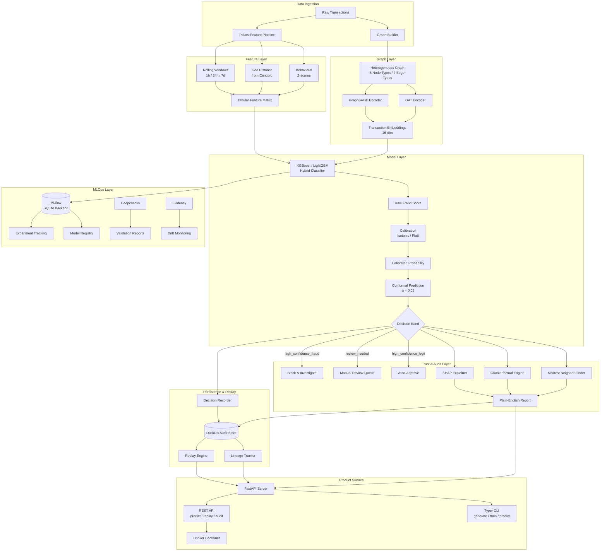

---

## Data Generation & Feature Engineering Pipeline

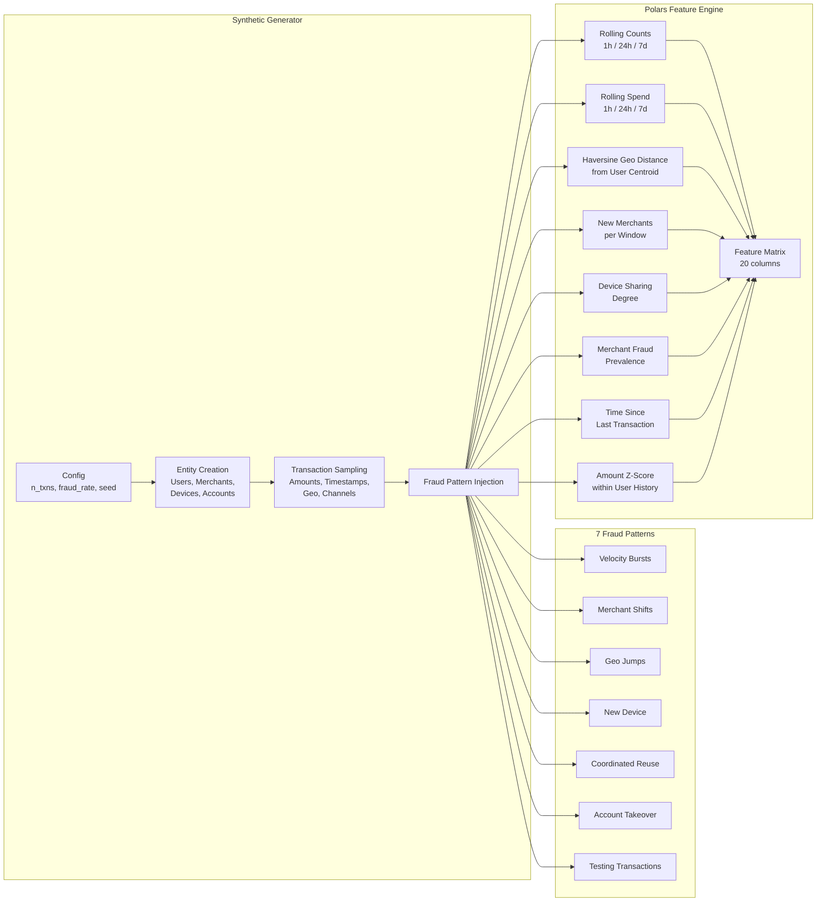

---

## Heterogeneous Graph Schema

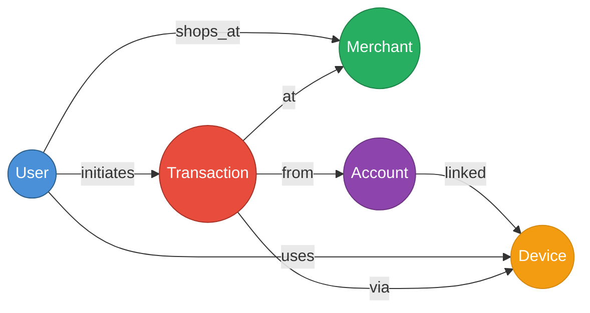

| Node Type | Count (100K txns) | Features |
|---|---|---|
| `user` | ~5,000 | Identity (degree computed) |
| `merchant` | ~1,200 | Identity (fraud rate computed) |
| `device` | ~8,000 | Identity (sharing degree) |
| `account` | ~6,000 | Identity (device count) |
| `transaction` | 100,000 | 20-dim engineered features |

---

## Model Architecture Comparison

```mermaid
flowchart TD
    subgraph baseA ["Baseline A: Tabular XGBoost"]
        A1[Tabular Features<br/>20-dim] --> A2[XGBoost<br/>depth=5, η=0.1]
        A2 --> A3[Raw Score]
    end

    subgraph baseB ["Baseline B: GraphSAGE Only"]
        B1[Node Features] --> B2[GraphSAGE<br/>2 layers, 32→16]
        B2 --> B3[MLP Head<br/>16→8→1]
        B3 --> B4[Raw Score]
    end

    subgraph hybrid ["Flagship: GraphSAGE + XGBoost"]
        C1[Node Features] --> C2[GraphSAGE<br/>2 layers, 32→16]
        C2 --> C3[Embeddings<br/>16-dim]
        C4[Tabular Features<br/>20-dim] --> C5[Concatenate]
        C3 --> C5
        C5 --> C6[XGBoost<br/>36-dim input]
        C6 --> C7[Raw Score]
    end

    subgraph alt ["Alternative: GAT + XGBoost"]
        D1[Node Features] --> D2[GAT<br/>4 heads, 2 layers]
        D2 --> D3[Attention-Weighted<br/>Embeddings 16-dim]
        D4[Tabular Features] --> D5[Concatenate]
        D3 --> D5
        D5 --> D6[XGBoost / LightGBM]
        D6 --> D7[Raw Score]
    end
```

### GraphSAGE Layer Detail

```mermaid
flowchart LR
    X[Node Feature x_v] --> LS[Linear_self]
    N[Neighbor Mean<br/>MEAN{x_u : u ∈ N_v}] --> LN[Linear_neigh]
    LS --> ADD[+]
    LN --> ADD
    ADD --> RELU[ReLU]
    RELU --> DROP[Dropout 0.1]
    DROP --> OUT[h_v]
```

### GAT Attention Mechanism

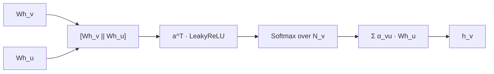

---

## Calibration & Conformal Prediction Pipeline

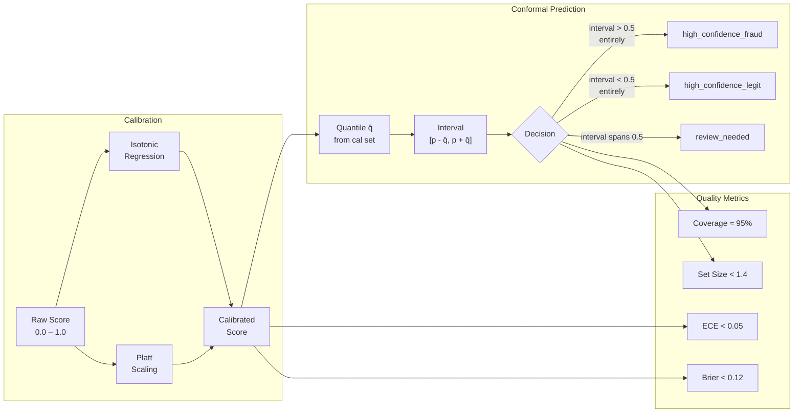

---

## Audit & Replay Architecture


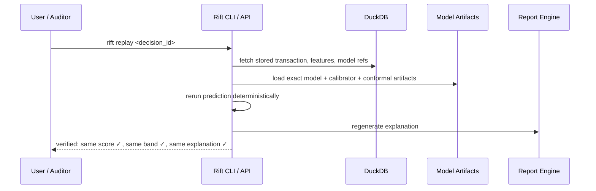

### DuckDB Schema

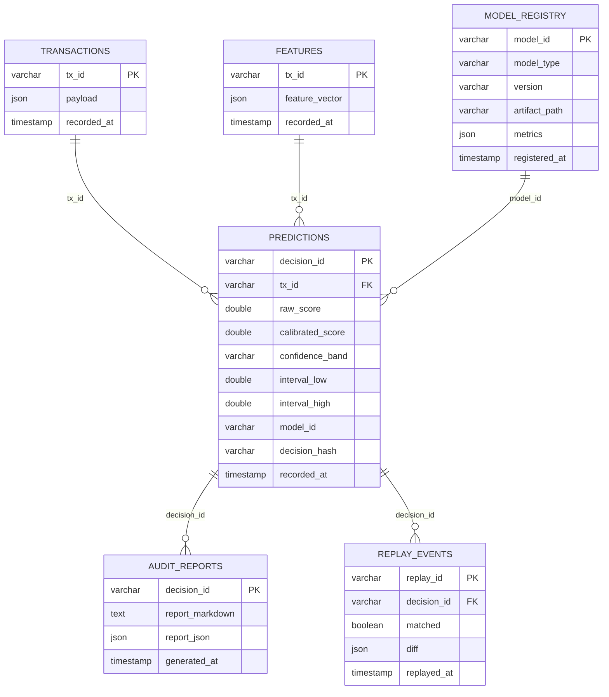

---

## MLOps & Monitoring Architecture

```mermaid
flowchart TB
    subgraph tracking ["Experiment Tracking"]
        TR[Training Run] --> MLF[(MLflow<br/>SQLite Backend)]
        MLF --> PARAMS[Parameters<br/>model_type, lr, epochs]
        MLF --> METRICS[Metrics<br/>PR-AUC, ECE, Brier]
        MLF --> ARTS[Artifacts<br/>model.pkl, calibrator.pkl]
        MLF --> REG[Model Registry<br/>staging → production]
    end

    subgraph validation ["Continuous Validation"]
        REF[Reference Data] --> DC[Deepchecks Suite]
        CUR[Current Data] --> DC
        DC --> INT[Data Integrity]
        DC --> PERF[Model Performance]
        DC --> BIAS[Bias Detection]
        DC --> HTML[HTML Report]
    end

    subgraph monitoring ["Drift Monitoring"]
        PROD[Production Data] --> EV[Evidently AI]
        BASELINE[Training Data] --> EV
        EV --> DD[Data Drift]
        EV --> TD[Target Drift]
        EV --> QM[Quality Metrics]
        EV --> DASH[Streamlit Dashboard]
    end

    subgraph search ["Semantic Audit Search"]
        AUDITS[Audit Reports] --> EMB[Sentence-BERT<br/>all-MiniLM-L6-v2]
        EMB --> VEC[(FAISS Index<br/>384-dim)]
        QUERY[Natural Language Query] --> VEC
        VEC --> TOP[Top-K Similar Audits]
    end

    subgraph cicd ["CI/CD Gates"]
        PR[Pull Request] --> GHA[GitHub Actions]
        GHA --> LINT[Ruff Lint]
        GHA --> TEST[Pytest Suite]
        GHA --> VALID[Deepchecks Gate]
        VALID --> MERGE{Merge?}
    end
```

---

## Explainability Stack

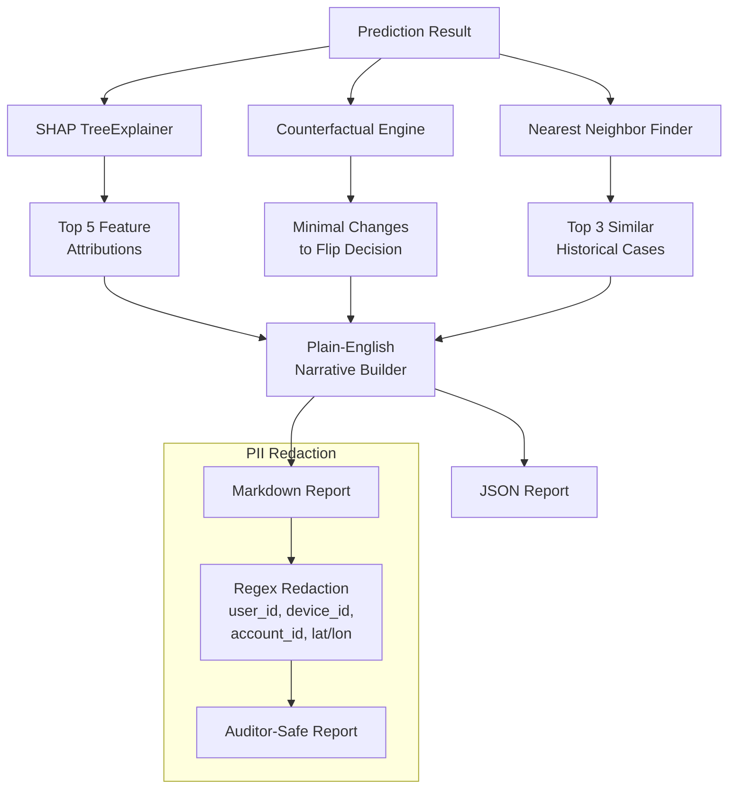

---

## Training Experiment Flow

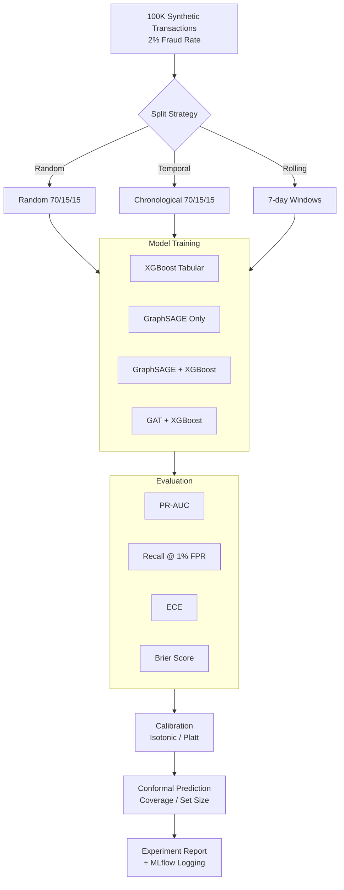

---

## Ollama Audit Chat Flow

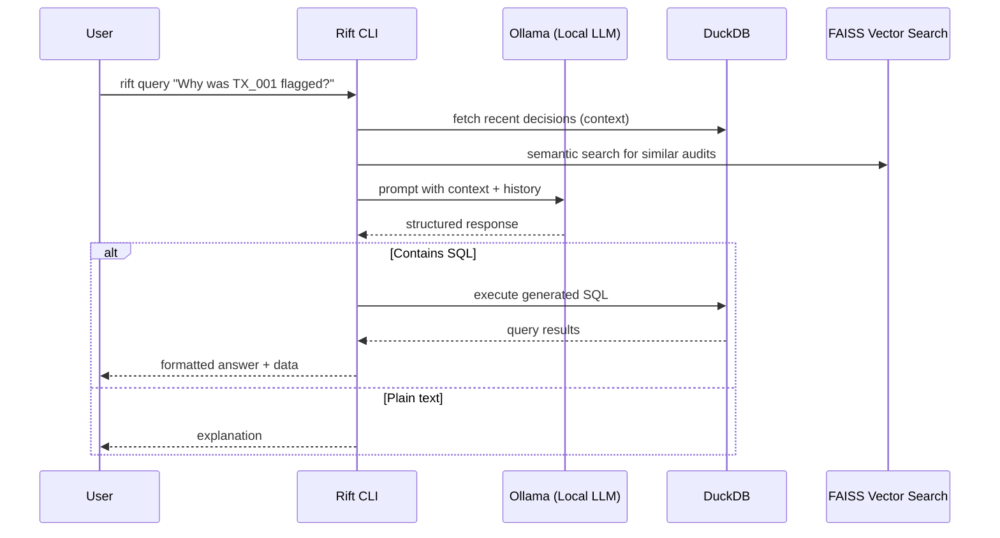

---

## Deployment Architecture

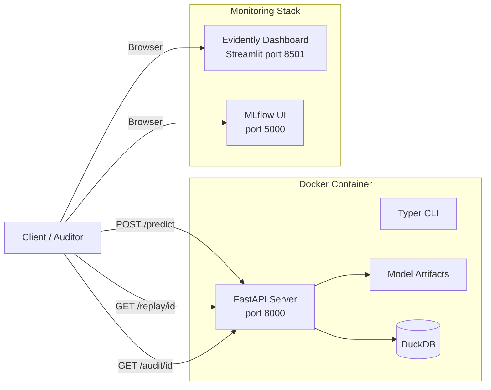

---

## Repository Structure

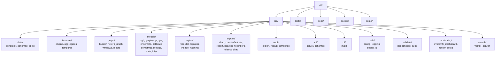

---

## Technology Stack

| Layer | Technology | Purpose |
|---|---|---|
| Feature Engineering | Polars | Fast columnar feature computation |
| Graph Neural Networks | PyTorch + custom GNN layers | GraphSAGE, GAT encoders |
| Gradient Boosting | XGBoost / LightGBM | Tabular + embedding classification |
| Calibration | scikit-learn | Isotonic regression, Platt scaling |
| Conformal Prediction | Custom (distribution-free) | Uncertainty-aware triage |
| Explainability | SHAP | Feature importance attribution |
| Audit Store | DuckDB | Embedded analytical database |
| Experiment Tracking | MLflow (SQLite backend) | Params, metrics, artifacts, registry |
| Validation | Deepchecks | Data integrity, bias, performance |
| Monitoring | Evidently AI + Streamlit | Drift detection dashboards |
| Vector Search | FAISS + sentence-transformers | Semantic audit search |
| LLM Chat | Ollama (local) | Natural language audit queries |
| API | FastAPI | REST endpoints |
| CLI | Typer + Rich | Command-line interface |
| Containerization | Docker + Compose | Reproducible deployment |
| CI/CD | GitHub Actions | Lint, test, validation gates |
