# Rift System Architecture

> Comprehensive technical architecture of the Rift fraud detection platform.
> All diagrams use [Mermaid.js](https://mermaid.js.org/) for inline rendering on GitHub.

---

## High-Level System Overview

Rift is built as a layered pipeline. Raw transactions enter from the left, pass through feature engineering and graph construction in parallel, merge at the hybrid model layer, flow through calibration and conformal prediction for trustworthy scoring, then fan out to explainability, audit recording, and the product surface (API + CLI). Every decision is recorded in DuckDB with a SHA-256 hash so it can be replayed later for compliance verification.

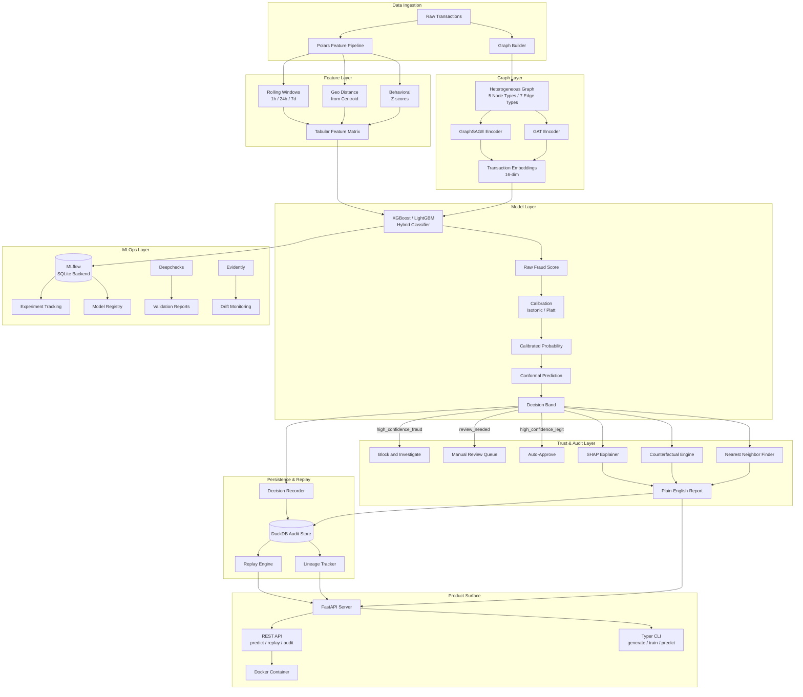

The system is organized into six layers:

1. **Data Ingestion** -- synthetic transaction generation with 7 injected fraud patterns, or ingestion of real data through the ETL pipeline.
2. **Feature Layer** -- Polars-based behavioral feature engineering producing 20 columns (rolling windows, geo distance, z-scores, device sharing, merchant fraud prevalence).
3. **Graph Layer** -- heterogeneous graph construction with 5 node types and 7 edge types, encoded by GraphSAGE or GAT into 16-dimensional embeddings.
4. **Model Layer** -- hybrid ensemble (GNN embeddings + tabular features fed to XGBoost), followed by isotonic/Platt calibration and conformal prediction for 3-class triage.
5. **Trust & Audit Layer** -- SHAP feature importance, counterfactual analysis, nearest-neighbor analogs, and plain-English report generation. Every decision is recorded with a SHA-256 hash in DuckDB.
6. **Product Surface** -- FastAPI REST API, Typer CLI, Docker containerization, MLflow experiment tracking, Deepchecks validation, Evidently drift monitoring.

---

## Data Generation & Feature Engineering Pipeline

The synthetic generator creates realistic fintech transaction data with configurable parameters (number of transactions, users, merchants, fraud rate, seed). Seven distinct fraud patterns are injected: velocity bursts, unusual merchant shifts, geographic jumps, new device usage, coordinated device reuse, account takeover sequences, and small "testing" transactions followed by large ones. The feature engine then computes 20 behavioral features using Polars.

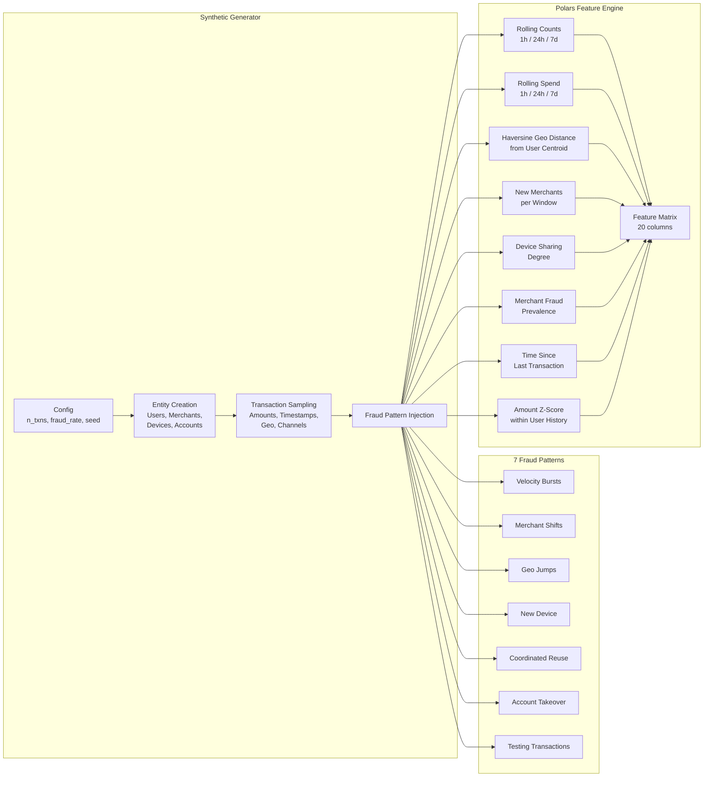

**Feature descriptions:**

| Feature | Window | Description |
|---|---|---|
| `tx_count_1h/24h/7d` | 1h, 24h, 7d | Number of transactions by this user in the rolling window |
| `spend_1h/24h/7d` | 1h, 24h, 7d | Total spend by this user in the rolling window |
| `dist_from_centroid` | All history | Haversine distance (km) from the user's running average lat/lon |
| `new_merchants_24h/7d` | 24h, 7d | Count of distinct merchants visited in the window |
| `devices_per_account` | Global | Number of distinct devices linked to this account |
| `merchant_fraud_rate` | Global | Historical fraud rate of the merchant (guarded at inference) |
| `device_sharing_degree` | Global | Number of distinct users sharing this device |
| `time_since_last_tx` | Sequential | Seconds since the user's previous transaction |
| `amount_zscore` | Per-user | Standard deviations above or below the user's mean spend |
| `channel_web/mobile/pos` | N/A | One-hot encoding of the transaction channel |

---

## Heterogeneous Graph Schema

Rift models fraud as a relational problem. Instead of treating each transaction as an independent row, the graph builder connects transactions to the users, merchants, devices, and accounts involved. This allows graph neural networks to propagate information across shared neighbors -- for example, detecting that two transactions share a suspicious device, or that a merchant has unusually high fraud rates among its connected users.

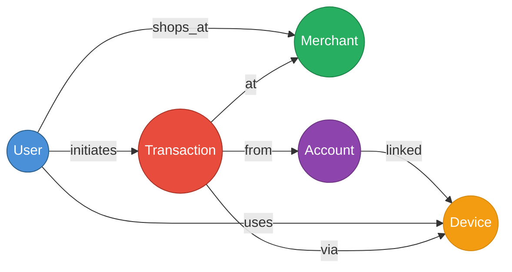

| Node Type | Count (100K txns) | Features |
|---|---|---|
| `user` | ~5,000 | Identity (degree computed) |
| `merchant` | ~1,200 | Identity (fraud rate computed) |
| `device` | ~8,000 | Identity (sharing degree) |
| `account` | ~6,000 | Identity (device count) |
| `transaction` | 100,000 | 20-dim engineered features |

**Edge types** capture seven relationships: a user *initiates* a transaction, a transaction occurs *at* a merchant, *via* a device, *from* an account. Additionally, users *use* devices, users *shop at* merchants, and accounts are *linked* to devices. The graph supports full static construction, rolling 7-day windows, and rolling 30-day windows for temporal evaluation.

---

## Model Architecture Comparison

Rift trains four model variants to enable ablation experiments. The tabular baseline proves what features alone can do. The GraphSAGE-only baseline shows what graph structure captures. The hybrid models (GraphSAGE+XGBoost and GAT+XGBoost) demonstrate the synergy of combining both signal sources.

```mermaid
flowchart TD
    subgraph baseA ["Baseline A: Tabular XGBoost"]
        A1[Tabular Features<br/>20-dim] --> A2[XGBoost<br/>depth=5, eta=0.1]
        A2 --> A3[Raw Score]
    end

    subgraph baseB ["Baseline B: GraphSAGE Only"]
        B1[Node Features] --> B2[GraphSAGE<br/>2 layers, 32 then 16]
        B2 --> B3[MLP Head<br/>16 then 8 then 1]
        B3 --> B4[Raw Score]
    end

    subgraph hybrid ["Flagship: GraphSAGE + XGBoost"]
        C1[Node Features] --> C2[GraphSAGE<br/>2 layers, 32 then 16]
        C2 --> C3[Embeddings<br/>16-dim]
        C4[Tabular Features<br/>20-dim] --> C5[Concatenate]
        C3 --> C5
        C5 --> C6[XGBoost<br/>36-dim input]
        C6 --> C7[Raw Score]
    end

    subgraph alt ["Alternative: GAT + XGBoost"]
        D1[Node Features] --> D2[GAT<br/>4 heads, 2 layers]
        D2 --> D3[Attention-Weighted<br/>Embeddings 16-dim]
        D4[Tabular Features] --> D5[Concatenate]
        D3 --> D5
        D5 --> D6[XGBoost / LightGBM]
        D6 --> D7[Raw Score]
    end
```

### GraphSAGE Layer Detail

Each GraphSAGE layer performs mean aggregation over a node's neighborhood, then combines the self-representation with the aggregated neighbor representation through separate linear transformations. The two are summed, passed through ReLU activation, and dropout is applied for regularization. Rift uses 2 layers (hidden dim 32, output dim 16) with dropout 0.1.

**Forward pass for node v:**
1. Compute neighbor mean: `h_N = MEAN( h_u for all u in neighbors of v )`
2. Transform self and neighbor: `h_v' = Linear_self(h_v) + Linear_neigh(h_N)`
3. Apply activation: `h_v' = ReLU(h_v')`
4. Apply dropout: `h_v' = Dropout(h_v', p=0.1)`

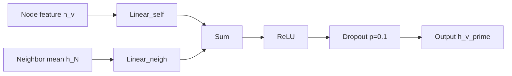

### GAT Attention Mechanism

GAT replaces the uniform mean aggregation with learned attention weights. For each edge (v, u), an attention coefficient is computed by concatenating the transformed features of both nodes and passing them through a learned attention vector. Softmax normalizes the coefficients across all neighbors, producing a weighted sum that focuses on the most relevant connections. Rift uses 4 attention heads in the first layer and 1 head in the output layer.

**Attention computation for edge (v, u):**
1. Transform both nodes: `Wh_v`, `Wh_u`
2. Compute attention logit: `e_vu = LeakyReLU( a^T * concat(Wh_v, Wh_u) )`
3. Normalize: `alpha_vu = softmax_over_neighbors(e_vu)`
4. Aggregate: `h_v' = SUM( alpha_vu * Wh_u for all u in neighbors of v )`

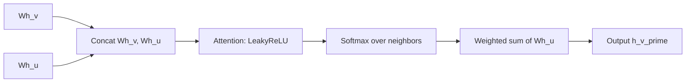

---

## Calibration & Conformal Prediction Pipeline

Raw model outputs are not well-calibrated probabilities -- a score of 0.90 does not necessarily mean 90% of transactions at that level are truly fraudulent. Rift applies post-hoc calibration (isotonic regression or Platt scaling) to align scores with actual fraud rates, then wraps them in conformal prediction to produce uncertainty-aware decision bands.

**Calibration** fits a monotone mapping from raw scores to calibrated probabilities on a held-out calibration set. Isotonic regression is non-parametric and flexible; Platt scaling fits a logistic regression.

**Conformal prediction** computes a nonconformity quantile `q_hat` from calibration residuals at significance level alpha = 0.05. For each new prediction with calibrated score `p`, the confidence interval is `[p - q_hat, p + q_hat]`. If the interval lies entirely above 0.5, the decision is `high_confidence_fraud`. If entirely below, `high_confidence_legit`. If it spans 0.5, `review_needed`. This guarantees that the true label is covered at least 95% of the time.

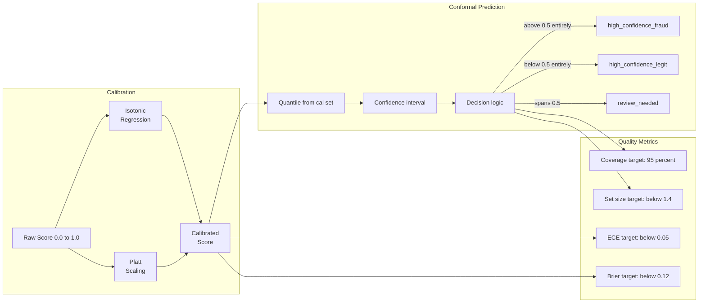

**Target metrics:**

| Metric | Target | Description |
|---|---|---|
| ECE | < 0.05 | Expected Calibration Error after isotonic calibration |
| Brier Score | < 0.12 | Mean squared error between predicted probability and outcome |
| Coverage | ~95% | Fraction of true labels contained in the conformal prediction set |
| Set Size | < 1.4 | Average number of classes in the prediction set (1 = certain, 2 = uncertain) |

---

## Audit & Replay Architecture

Every prediction flows through the Decision Recorder, which stores the transaction payload, computed features, raw and calibrated scores, confidence band, model version references, SHAP explanation, and a SHA-256 hash of the canonical JSON payload. This creates an immutable audit trail in DuckDB.

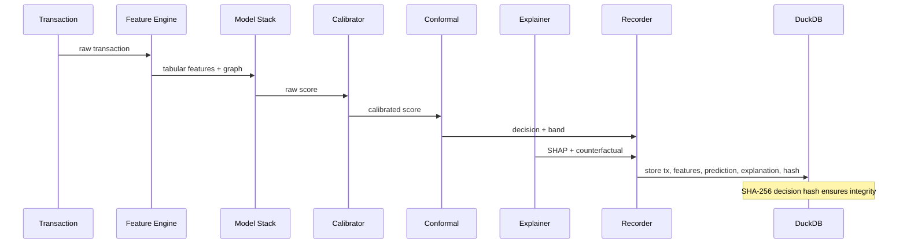

**Replay** means re-running the exact same computation to verify the outcome has not changed. An auditor or compliance reviewer provides a decision ID. The replay engine fetches the stored transaction, loads the exact model and calibration artifacts that were used at prediction time, re-runs the prediction, and compares the result with the stored hash. A match confirms deterministic reproducibility.

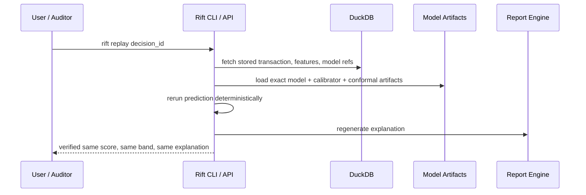

### DuckDB Schema

The audit store consists of six tables. `transactions` stores raw payloads. `features` stores computed feature vectors. `predictions` stores the full decision record including hash. `model_registry` tracks model metadata. `audit_reports` stores generated plain-English reports. `replay_events` logs every replay verification attempt with match status.

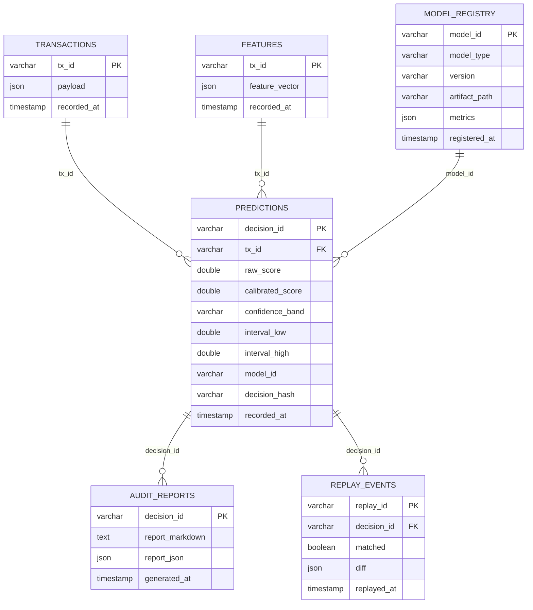

---

## MLOps & Monitoring Architecture

Rift integrates production-grade MLOps tooling for experiment tracking, continuous validation, drift monitoring, and semantic search over audit artifacts. All tools are zero-cost and open-source, running locally without external services.

**MLflow (SQLite backend)** logs every training run's parameters, metrics (PR-AUC, ECE, Brier), and artifacts (model pickles, calibrator, conformal predictor). The SQLite backend provides persistent, queryable storage without a server process.

**Deepchecks** runs automated validation suites covering data integrity (missing values, duplicates, type consistency), model performance (PR-AUC thresholds, ROC checks), and bias detection. Reports are generated as HTML and can be used as CI/CD quality gates.

**Evidently AI** monitors data drift and target drift between a reference dataset (training data) and current production data. A Streamlit dashboard provides an interactive UI for exploring drift reports.

**FAISS + sentence-transformers** indexes audit records and reports into a 384-dimensional vector space, enabling semantic search queries like "find similar high-velocity fraud cases."

```mermaid
flowchart TB
    subgraph tracking ["Experiment Tracking"]
        TR[Training Run] --> MLF[(MLflow<br/>SQLite Backend)]
        MLF --> PARAMS[Parameters<br/>model_type, lr, epochs]
        MLF --> METRICS[Metrics<br/>PR-AUC, ECE, Brier]
        MLF --> ARTS[Artifacts<br/>model.pkl, calibrator.pkl]
        MLF --> REG[Model Registry<br/>staging to production]
    end

    subgraph validation ["Continuous Validation"]
        REF[Reference Data] --> DC[Deepchecks Suite]
        CUR[Current Data] --> DC
        DC --> INT[Data Integrity]
        DC --> PERF[Model Performance]
        DC --> BIAS[Bias Detection]
        DC --> HTML[HTML Report]
    end

    subgraph monitoring ["Drift Monitoring"]
        PROD[Production Data] --> EV[Evidently AI]
        BASELINE[Training Data] --> EV
        EV --> DD[Data Drift]
        EV --> TD[Target Drift]
        EV --> QM[Quality Metrics]
        EV --> DASH[Streamlit Dashboard]
    end

    subgraph search ["Semantic Audit Search"]
        AUDITS[Audit Reports] --> EMB[Sentence-BERT<br/>all-MiniLM-L6-v2]
        EMB --> VEC[(FAISS Index<br/>384-dim)]
        QUERY[Natural Language Query] --> VEC
        VEC --> TOP[Top-K Similar Audits]
    end

    subgraph cicd ["CI/CD Gates"]
        PR[Pull Request] --> GHA[GitHub Actions]
        GHA --> LINT[Ruff Lint]
        GHA --> TEST[Pytest Suite]
        GHA --> VALID[Deepchecks Gate]
        VALID --> MERGE["Merge decision"]
    end
```

---

## Explainability Stack

Rift layers three explanation methods to produce reports that are useful for both technical reviewers and non-technical auditors.

**SHAP (TreeExplainer)** computes game-theoretic feature attributions for the XGBoost component, identifying which features most influenced the score. Top-5 features are surfaced.

**Counterfactual analysis** uses greedy perturbation to find the minimal feature changes that would flip the decision. For example: "If the amount had been under $200, the decision would have been approve."

**Nearest-neighbor search** finds the most similar historical transactions by cosine similarity in feature space and reports whether they were fraudulent or legitimate.

All three are combined into a **plain-English narrative** that avoids ML jargon. PII (user IDs, device IDs, account IDs, coordinates) is automatically redacted via regex before external distribution.

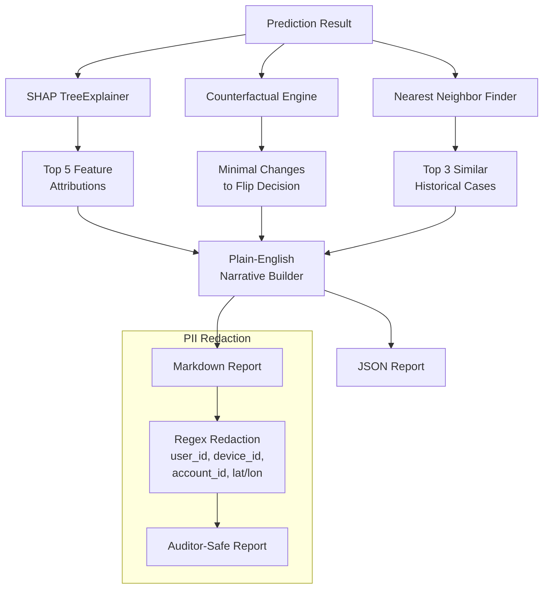

---

## Training Experiment Flow

Rift defines five experiments to validate its core claims. Each experiment is run by training the relevant model variants on the same dataset with the same seed, varying only the experimental factor (split strategy, model type, calibration method, etc.).

**Experiment 1 (Relational vs Tabular):** Compares XGBoost-only, GraphSAGE-only, and hybrid to show that graph structure improves fraud detection.

**Experiment 2 (Temporal Leakage):** Compares random vs chronological vs rolling-window splits to demonstrate that random splits inflate metrics.

**Experiment 3 (Calibration):** Compares raw, Platt-scaled, and isotonic-scaled scores on ECE and Brier to show that calibration improves operational trustworthiness.

**Experiment 4 (Conformal Uncertainty):** Compares binary hard labels vs 3-class conformal triage on coverage, set size, and review rate reduction.

**Experiment 5 (Explainability):** Generates 10 audit reports and scores them on clarity, actionability, and jargon avoidance.

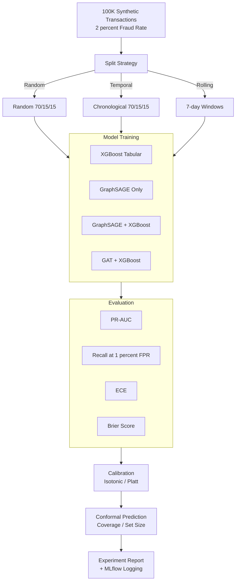

---

## Ollama Audit Chat Flow

The Ollama integration provides a conversational audit assistant that runs entirely offline using a local LLM (e.g., llama3.1:8b). When a user asks a natural language question, the assistant fetches recent decisions from DuckDB for context, runs a semantic search via FAISS for relevant prior audits, and prompts the LLM with structured instructions. If the LLM generates a SQL query, it is automatically executed against DuckDB and the results are returned. Multi-turn chat history is maintained for follow-up questions.

When Ollama is not available, the system falls back to direct SQL pattern matching (keyword-based routing to pre-built queries).

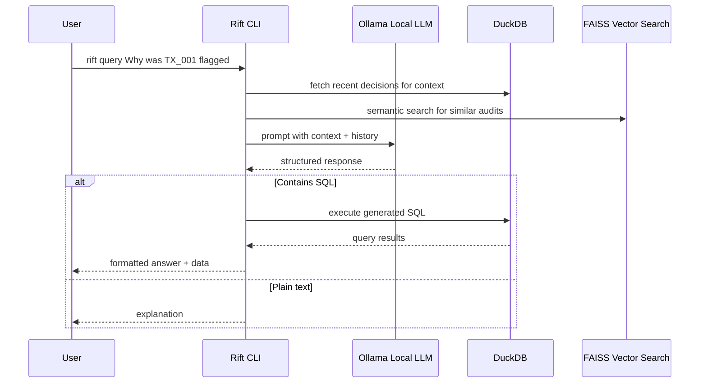

---

## Deployment Architecture

Rift runs as a single Docker container exposing the FastAPI server on port 8000. The CLI, model artifacts, and DuckDB audit store all live inside the container. Optionally, the Evidently Streamlit dashboard runs on port 8501 and the MLflow UI on port 5000 for monitoring and experiment browsing.

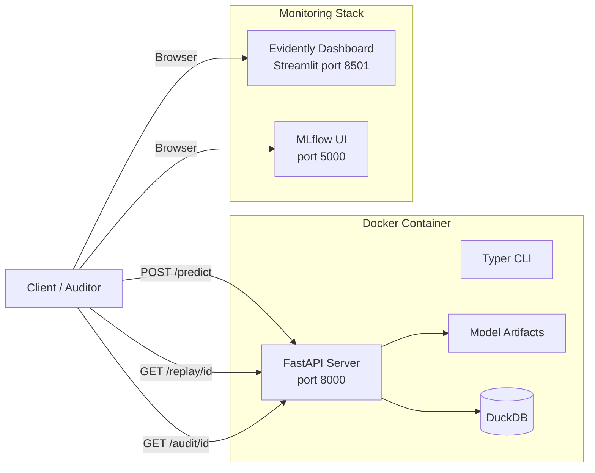

**API Endpoints:**

| Method | Endpoint | Description |
|---|---|---|
| POST | `/predict` | Score a transaction and record the decision |
| GET | `/replay/{decision_id}` | Replay a past decision for verification |
| GET | `/audit/{decision_id}` | Generate or retrieve an audit report |
| GET | `/metrics/latest` | Get metrics for the latest trained model |
| GET | `/models/current` | Get info about the currently deployed model |
| GET | `/health` | Health check |

**CLI Commands:**

| Command | Description |
|---|---|
| `rift generate` | Generate synthetic transaction data |
| `rift train` | Train a fraud detection model |
| `rift predict` | Score a transaction from a JSON file |
| `rift replay` | Replay a past decision |
| `rift audit` | Generate an audit report |
| `rift export` | Bulk export decisions |
| `rift validate` | Run Deepchecks validation suite |
| `rift monitor` | Generate drift reports or launch dashboard |
| `rift query` | Natural language audit queries (Ollama) |
| `rift search-audits` | Semantic search over audit records |
| `rift serve` | Start the FastAPI server |

---

## Repository Structure

The codebase is organized into focused modules under `src/`. Each module has a single responsibility and can be tested independently. The `src/rift/` subtree contains the extended governance, ETL, and monitoring modules from the main branch.

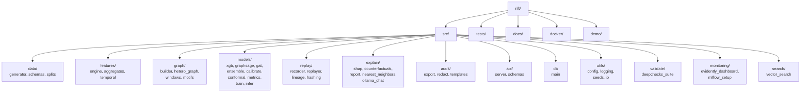

---

## Technology Stack

| Layer | Technology | Purpose |
|---|---|---|
| Feature Engineering | Polars | Fast columnar feature computation |
| Graph Neural Networks | PyTorch + custom GNN layers | GraphSAGE, GAT encoders |
| Gradient Boosting | XGBoost / LightGBM | Tabular + embedding classification |
| Calibration | scikit-learn | Isotonic regression, Platt scaling |
| Conformal Prediction | Custom (distribution-free) | Uncertainty-aware triage |
| Explainability | SHAP | Feature importance attribution |
| Audit Store | DuckDB | Embedded analytical database |
| Experiment Tracking | MLflow (SQLite backend) | Params, metrics, artifacts, registry |
| Validation | Deepchecks | Data integrity, bias, performance |
| Monitoring | Evidently AI + Streamlit | Drift detection dashboards |
| Vector Search | FAISS + sentence-transformers | Semantic audit search |
| LLM Chat | Ollama (local) | Natural language audit queries |
| API | FastAPI | REST endpoints |
| CLI | Typer + Rich | Command-line interface |
| Containerization | Docker + Compose | Reproducible deployment |
| CI/CD | GitHub Actions | Lint, test, validation gates |
