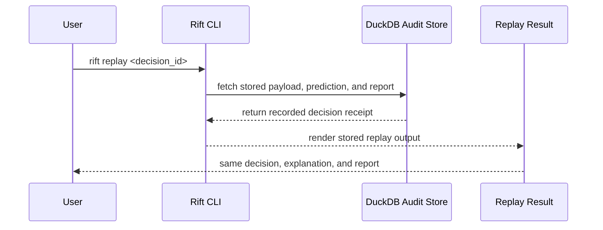
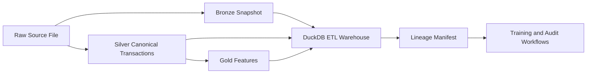

# Audit Guide

Rift records every model decision like a receipt. That receipt can be replayed later to verify the same outcome and explanation without needing to inspect model code.

## What the system does

Rift scores a transaction for fraud risk, calibrates that score so it behaves more like a usable probability, and then assigns one of three operational outcomes:

- `high_confidence_fraud`
- `review_needed`
- `high_confidence_legit`

## What a decision ID means

Each prediction is stored with a deterministic SHA-256 decision ID. The ID is computed from a canonical JSON record of the transaction payload, model run, prediction, and explanation.

## How to replay a decision

Use the CLI:

```bash
rift replay <decision_id>
```

Replay fetches the stored transaction, features, model references, and prediction record from DuckDB and verifies the stored output.



## What "confidence" means

Confidence in Rift is not just the raw model score. It combines:

1. a calibrated probability, and
2. a conformal prediction band that indicates whether the system is confident enough to make a direct decision.

## What "review needed" means

`review_needed` means the model did not have enough evidence to place the transaction confidently into a single class. The transaction should be routed to manual review rather than silently approved or blocked.

## How personal data is redacted

The MVP stores synthetic data by default. When real data is used, personal information should be redacted before export. The audit export functions are structured so sensitive fields can be filtered before they leave the audit store.

## How source provenance is tracked

Rift now includes an ETL lineage layer for raw operational data.



For each ETL run, Rift stores:

- the source path and source system;
- extracted, valid, invalid, and loaded row counts;
- bronze, silver, and gold artifact paths;
- a lineage manifest JSON file;
- warehouse status in DuckDB.

Sensitive fields such as names, email addresses, and taxpayer identifiers are hashed before the silver layer is written.

## Fairness and governance review

Rift can also generate fairness audit reports for a chosen sensitive column.

These reports summarize:

- group-level selection rates;
- demographic parity difference;
- disparate impact ratio;
- equal opportunity difference when labels are present.

The reports are written locally under `.rift/governance/fairness/` and summarized in the built-in dashboard.

## Model cards and drift reports

Rift can generate model cards for trained runs and drift reports for monitoring comparisons.

These artifacts are intended for:

- compliance handoff;
- model review meetings;
- audit prep;
- non-technical governance summaries.

They are written locally under:

- `.rift/governance/model_cards/`
- `.rift/governance/drift/`

## What is currently stored

The MVP stores decision records in DuckDB tables for:

- transactions
- features
- predictions
- audit_reports
- replay_events

The ETL warehouse stores:

- etl_runs
- bronze_transactions
- silver_transactions
- gold_features

The local lakehouse layer also provides SQL views over current transaction and feature snapshots so teams can inspect operational state without exporting data into a paid warehouse.

Each stored prediction includes the payload, derived features, model run ID, calibrated probability, decision label, explanation, and report output.

## Example report

An audit report includes:

- decision ID
- decision time
- outcome
- calibrated fraud probability
- top drivers
- a plain-English explanation
- replay instructions

You can also fetch these through the API:

- `GET /replay/{decision_id}`
- `GET /audit/{decision_id}`
- `GET /fairness/status`
- `GET /monitor/drift-status`
- `GET /query`
- `GET /dashboard`

Example wording:

> This transaction was flagged because it came from a new device, was far from the user's recent activity centroid, and followed an elevated transaction velocity window. The system is confident enough to recommend manual review or intervention depending on policy.
