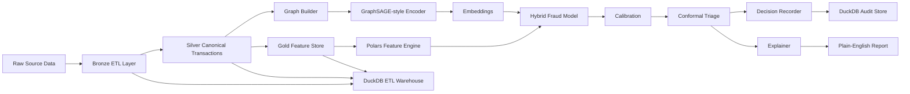
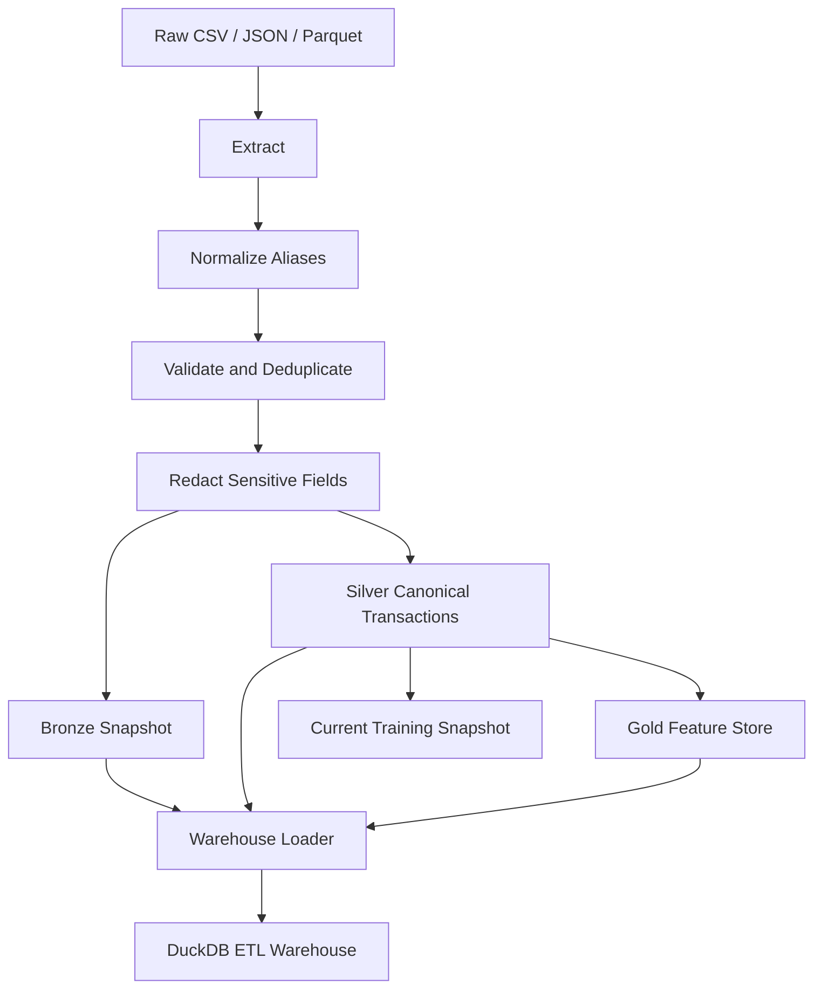

# Rift

**Graph ML for fraud detection, replay, and audit**

[](pyproject.toml)
[](LICENSE)

Rift is an auditable fraud detection system that combines graph-aware fraud scoring, calibrated probabilities, conformal uncertainty, deterministic replay, and plain-English audit reports.



## Why Rift exists

Fraud is relational, not just tabular. A realistic fraud system needs to account for shared devices, coordinated merchants, account reuse, temporal drift, and operational uncertainty. Rift packages those concerns into a single developer-friendly project that is practical enough to run and rigorous enough to demonstrate trustworthy ML ideas.

## What Rift proves

Rift is designed to demonstrate five claims:

1. relational structure can improve fraud detection;
2. time-aware evaluation matters;
3. scores should be calibrated before use in decisioning;
4. uncertainty belongs in high-stakes workflows;
5. explanations must be usable by non-technical reviewers.

## Quick start

Install the project in editable mode:

```bash
python3 -m pip install -e ".[dev]"
```

Generate demo data, train a model, and score a sample transaction:

```bash
rift generate --txns 5000 --users 500 --merchants 120 --fraud-rate 0.03
rift train --model graphsage_xgb --time-split
rift predict --tx demo/sample_transaction.json
```

Replay a recorded decision or export an audit report:

```bash
rift replay <decision_id>
rift audit <decision_id> --format markdown
```

Run the ETL pipeline on a government-style raw source file:

```bash
rift etl run --source demo/government_transactions.csv --source-system treasury_disbursements --dataset-name gov_demo
rift etl status --limit 5
```

## Current implemented surface

The current MVP ships these CLI commands:

- `rift etl run --source <path>`
- `rift etl status`
- `rift generate`
- `rift train`
- `rift predict --tx <path>`
- `rift replay <decision_id>`
- `rift audit <decision_id> --format {markdown,json}`
- `rift compare`
- `rift export --format {markdown,json}`

Supported training modes today:

- `xgb_tabular`
- `graphsage_only`
- `graphsage_xgb`

Artifacts are written under `.rift/` by default:

- `.rift/data/transactions.parquet`
- `.rift/data/features.parquet`
- `.rift/etl/bronze/*.parquet`
- `.rift/etl/silver/*.parquet`
- `.rift/etl/gold/*.parquet`
- `.rift/etl/lineage/*.json`
- `.rift/etl/warehouse.duckdb`
- `.rift/runs/<run_id>/artifact.pkl`
- `.rift/runs/<run_id>/metrics.json`
- `.rift/audit/rift.duckdb`

## Government-ready ETL

Rift now includes an auditable ETL layer aimed at high-governance environments such as government finance, benefits, tax, and procurement workflows.

The pipeline supports:

- extraction from CSV, JSON, and Parquet sources;
- alias normalization from government-style source fields into Rift's canonical transaction schema;
- validation and bad-row filtering for timestamps and amounts;
- deterministic deduplication by transaction ID;
- redaction of direct sensitive fields such as names, emails, taxpayer identifiers, and addresses;
- bronze, silver, and gold data layers;
- lineage manifests and DuckDB warehouse loading for operational traceability.



## Architecture

Rift ships with:

- a synthetic fintech transaction simulator;
- an auditable bronze/silver/gold ETL pipeline;
- a Polars feature pipeline;
- a heterogeneous-to-transaction graph builder;
- a GraphSAGE-style relational encoder;
- tabular and hybrid fraud models;
- calibration and conformal triage;
- a DuckDB-backed replay and audit layer;
- CLI and FastAPI entry points.

## Demo flow

1. Generate a synthetic transaction history with injected fraud patterns.
2. Ingest and normalize raw records through the ETL pipeline when source data arrives externally.
3. Build temporal and behavioral features.
4. Construct a relational graph between transactions and shared entities.
5. Train a tabular or hybrid model.
6. Calibrate the model and fit a conformal triage layer.
7. Score new transactions and record each decision for replay.
8. Render plain-English audit reports for non-technical stakeholders.

## Experiments

The project supports the experiment themes laid out in the uploaded build spec:

- tabular vs graph-aware modeling;
- random vs chronological evaluation;
- raw vs calibrated scores;
- hard labels vs conformal triage.

Metrics include PR-AUC, recall at low FPR, Brier score, and expected calibration error.

## Audit mode

Every prediction can be recorded as an auditable decision receipt containing:

- the raw transaction payload;
- engineered features;
- the model run ID;
- calibrated probability and conformal band;
- the explanation and generated report;
- a deterministic decision hash.

See [AUDIT_GUIDE.md](AUDIT_GUIDE.md) for the non-technical walkthrough.

## API surface

The FastAPI app exposes:

- `POST /predict`
- `GET /replay/{decision_id}`
- `GET /audit/{decision_id}`
- `GET /etl/status`
- `GET /metrics/latest`
- `GET /models/current`

Run it locally with:

```bash
uvicorn rift.api.server:app --reload
```

## Documentation conventions

To keep the repo aligned with shipped behavior:

- update Markdown/docs whenever CLI, API, audit output, or workflow behavior changes;
- use Mermaid blocks for all diagrams;
- do not add ASCII art diagrams to docs.

## Roadmap

Current MVP:

- auditable ETL ingestion and feature loading;
- synthetic data generation;
- feature engineering;
- graph-aware hybrid training;
- calibration and conformal decision bands;
- deterministic replay and audit reporting.

Next iterations:

- stronger temporal graph models;
- richer counterfactuals;
- PDF report export;
- dashboarding and experiment notebooks.

## Contributing

Contributions are welcome. Please see [CONTRIBUTING.md](CONTRIBUTING.md).

## License

This project is open source and available under the [MIT License](LICENSE).