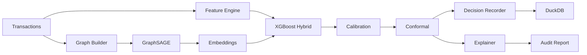
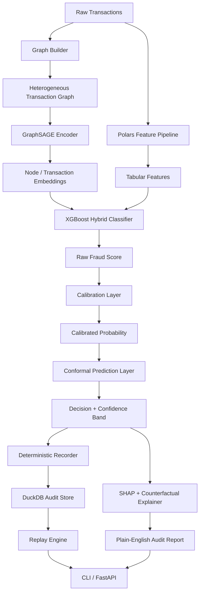
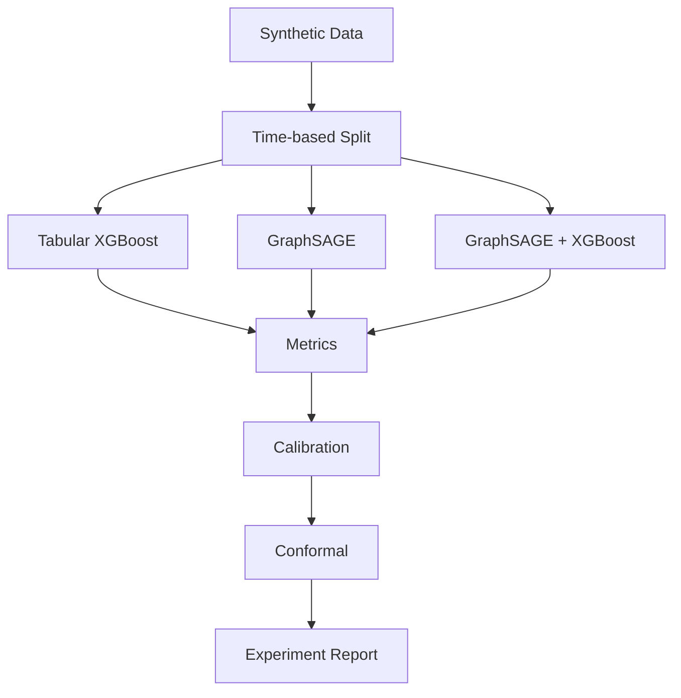
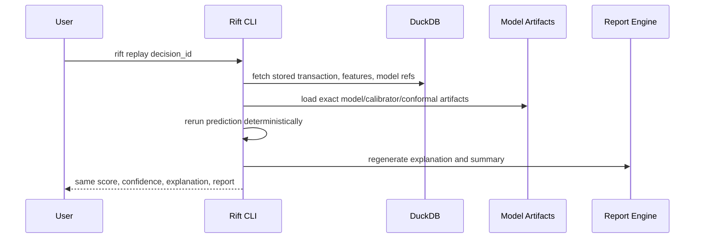

# Rift

**Graph ML for Fraud Detection, Replay, and Audit**

[](https://www.python.org/downloads/)
[](LICENSE)
[](https://github.com/astral-sh/ruff)

> An auditable fraud detection system that combines graph neural networks, calibrated risk scoring, conformal uncertainty, deterministic replay, and plain-English audit reports.



## 30-Second Quickstart

```bash
pip install -e ".[dev]"
export PYTHONPATH=src

# Generate data, train, predict
python -m cli.main generate --txns 10000 --fraud-rate 0.03
python -m cli.main train --model xgb_tabular --time-split
python -m cli.main predict --tx demo/sample_transaction.json
```

---

## 1. Why Rift Exists

Fraud detection is a high-stakes domain where model outputs directly affect people and businesses. Most fraud ML projects stop at a model notebook. Rift goes further by treating every prediction as an auditable, replayable decision with calibrated uncertainty and plain-English explanations.

## 2. What It Proves

Rift demonstrates five core principles:

1. **Fraud is relational, not just tabular.** Graph structure captures relationships between users, devices, merchants, and accounts that flat feature tables miss.
2. **Time-aware evaluation matters.** Random splits leak future patterns into training. Temporal splits give realistic performance estimates.
3. **Probabilities must be calibrated.** A score of 0.90 should behave like 90% risk. Isotonic and Platt calibration make this concrete.
4. **High-stakes decisions need uncertainty.** Conformal prediction adds confidence bands (fraud / review / legit) instead of raw labels.
5. **Explanations must be usable by non-technical people.** SHAP values, counterfactuals, and nearest-neighbor analogs are translated into plain English.

## 3. Architecture



### Components

| Module | Purpose |
|---|---|
| `data/` | Synthetic transaction generator with 7 fraud patterns |
| `features/` | Polars-based feature engineering (rolling windows, geo, z-scores) |
| `graph/` | Heterogeneous graph builder (5 node types, 7 edge types) |
| `models/` | XGBoost, GraphSAGE, GAT, hybrid ensemble, calibration, conformal |
| `replay/` | DuckDB-backed decision recording, deterministic replay, lineage |
| `explain/` | SHAP, counterfactuals, nearest neighbors, plain-English reports |
| `audit/` | Bulk export, PII redaction, Jinja2 report templates |
| `api/` | FastAPI server with predict, replay, audit endpoints |
| `cli/` | Typer CLI with generate, train, predict, replay, audit commands |

## 4. Quick Start

### Prerequisites

- Python 3.10+
- pip

### Installation

```bash
git clone https://github.com/AngelP17/Rift.git
cd Rift
pip install -e ".[dev]"
export PYTHONPATH=src
```

### Generate Synthetic Data

```bash
python -m cli.main generate --txns 100000 --users 5000 --merchants 1200 --fraud-rate 0.02
```

### Train Models

```bash
# Tabular baseline
python -m cli.main train --model xgb_tabular --time-split

# GraphSAGE only
python -m cli.main train --model graphsage_only --time-split

# Hybrid (flagship)
python -m cli.main train --model graphsage_xgb --time-split --window 7d

# GAT variant
python -m cli.main train --model gat_xgb --time-split
```

### Predict

```bash
python -m cli.main predict --tx demo/sample_transaction.json
```

### Replay & Audit

```bash
python -m cli.main replay <decision_id>
python -m cli.main audit <decision_id> --format markdown
python -m cli.main export --since 90d --format markdown
```

### Start API Server

```bash
python -m cli.main serve --port 8000
```

## 5. Demo Flow

```bash
# Full end-to-end demo
python -m cli.main generate --txns 10000 --fraud-rate 0.03
python -m cli.main train --model graphsage_xgb --time-split
python -m cli.main predict --tx demo/sample_transaction.json
# Copy the decision_id from output, then:
python -m cli.main replay <decision_id>
python -m cli.main audit <decision_id>
```

## 6. Experiments



| Experiment | Claim |
|---|---|
| **Relational vs Tabular** | Graph structure improves fraud detection over tabular-only |
| **Temporal Leakage** | Random splits inflate performance vs chronological splits |
| **Calibration** | Isotonic/Platt calibration improves operational trustworthiness |
| **Conformal Uncertainty** | Confidence bands reduce unnecessary manual review |
| **Explainability** | Plain-English reports are more usable than raw SHAP plots |

### Target Metrics

- PR-AUC > 0.85 on time split
- Recall@1% FPR > 0.60
- Brier score < 0.12
- ECE < 0.05 after isotonic calibration
- Conformal coverage near 95%, set size < 1.4

## 7. Audit Mode

Rift records every model decision like a receipt. See [AUDIT_GUIDE.md](AUDIT_GUIDE.md) for details.



### API Endpoints

| Method | Endpoint | Description |
|---|---|---|
| POST | `/predict` | Run fraud prediction |
| GET | `/replay/{decision_id}` | Replay a past decision |
| GET | `/audit/{decision_id}` | Get audit report |
| GET | `/metrics/latest` | Latest model metrics |
| GET | `/models/current` | Current model info |
| GET | `/health` | Health check |

## 8. Related Work

- NVIDIA 2025 Financial Fraud GNN Blueprint
- 2026 transaction risk work combining GNNs with probabilistic prediction
- 2026 trustworthy fraud framework (explainability + conformal prediction)
- 2025 systematic review of deep learning in financial fraud detection
- 2026 human-centered trust and explainability for graph-based systems

See [docs/theory.md](docs/theory.md) for full citations.

## 9. MLOps & Monitoring

Rift includes production-grade MLOps integrations. Install with:

```bash
pip install -e ".[all]"  # everything
pip install -e ".[mlops]"  # MLflow + ClearML
pip install -e ".[monitoring]"  # Evidently + Deepchecks + Streamlit
pip install -e ".[search]"  # FAISS + sentence-transformers
pip install -e ".[llm]"  # Ollama chat
```

### Experiment Tracking (MLflow / ClearML)

```bash
rift train --model graphsage_xgb --time-split --tracker mlflow --mlflow-backend sqlite
# Runs are logged to sqlite:///data/mlflow.db
```

### Continuous Validation (Deepchecks)

```bash
rift validate --suite deepchecks --ref data/reference.parquet --cur data/current.parquet
# Generates HTML report with data integrity, bias, and performance checks
```

### Drift Monitoring (Evidently)

```bash
rift monitor --ui evidently --ref data/reference.parquet --cur data/current.parquet
# Or launch the Streamlit dashboard:
rift monitor --ui streamlit
```

### Semantic Audit Search (FAISS)

```bash
rift search-audits --query "high velocity fraud from new device" --k 5
```

### Audit Chat (Ollama)

```bash
rift query --natural "How many high-confidence fraud decisions this week?"
rift query --natural "Explain decision DEC_ABC123" --chat  # multi-turn mode
```

## 10. Architecture

See [ARCHITECTURE.md](ARCHITECTURE.md) for the full system architecture with Mermaid.js diagrams.

## 11. Roadmap

- [x] Synthetic data generator with 7 fraud patterns
- [x] Polars feature engineering pipeline
- [x] Heterogeneous graph builder
- [x] XGBoost baseline, GraphSAGE, GAT, hybrid ensemble
- [x] Isotonic and Platt calibration
- [x] Conformal prediction (3-class triage)
- [x] SHAP + counterfactual explainability
- [x] Plain-English audit reports
- [x] Deterministic replay engine
- [x] DuckDB audit store
- [x] FastAPI + CLI
- [x] Docker support
- [x] MLflow SQLite experiment tracking
- [x] ClearML experiment tracker
- [x] Deepchecks continuous validation
- [x] Evidently drift monitoring + Streamlit dashboard
- [x] FAISS semantic audit search
- [x] Ollama audit chat assistant
- [x] GitHub Actions CI/CD pipeline
- [x] ARCHITECTURE.md with Mermaid diagrams
- [ ] Temporal GNN extension (TGAT)
- [ ] LightGBM booster option
- [ ] PDF report export
- [ ] Fairness audit module

## License

[MIT](LICENSE)
