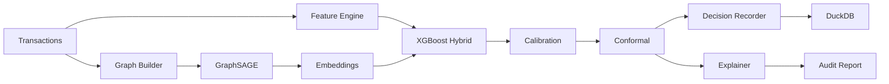

# Rift

**Graph ML for Fraud Detection, Replay, and Audit**

[](https://www.python.org/downloads/)
[](LICENSE)

---

## Executive Summary

- **What it is:** An auditable fraud detection system that scores transactions with graph neural networks, calibrated probabilities, and conformal uncertainty bands.
- **Who it's for:** ML engineers, fintech risk teams, auditors, and compliance reviewers (Big Four–style engagements).
- **Key differentiator:** Every decision is recorded like a receipt; deterministic replay verifies the same outcome; plain-English reports for non-technical stakeholders.
- **Regulatory alignment:** Documentation follows EU AI Act, NIST AI RMF, and audit best practices (see [docs/GOVERNANCE.md](docs/GOVERNANCE.md) and [docs/COMPLIANCE_MAPPINGS/](docs/COMPLIANCE_MAPPINGS/)).

Rift is an auditable fraud detection system that combines graph neural networks, calibrated risk scoring, conformal uncertainty, deterministic replay, and plain-English audit reports.



## Why Rift exists

- **For ML engineers**: Graph modeling, temporal robustness, calibration, uncertainty
- **For fintech risk teams**: Fraud scoring with replayable decisions
- **For auditors / Big Four**: Audit-ready reports and governance artifacts

## What it proves

1. Fraud is relational, not just tabular
2. Time-aware evaluation matters
3. Probabilities must be calibrated
4. High-stakes decisions need uncertainty
5. Explanations must be usable by non-technical people

## Quick start

```bash
# Install
pip install -e .

# Generate synthetic data
rift generate --txns 10000 --fraud-rate 0.02

# Train model
rift train --model graphsage_xgb --time-split

# Predict (requires trained model)
rift predict demo/sample_transaction.json

# Replay a decision
rift replay <decision_id>

# Export audit reports
rift export --since 90d --format markdown
```

## CLI Reference

| Command | Description |
|---------|-------------|
| `rift generate --txns N --fraud-rate R` | Generate synthetic transactions |
| `rift train --model MODEL --time-split` | Train (xgb_tabular, graphsage_only, graphsage_xgb, gat_xgb) |
| `rift predict FILE` | Predict fraud for transaction JSON |
| `rift replay DECISION_ID` | Replay stored decision for audit |
| `rift audit DECISION_ID --format markdown` | Generate audit report |
| `rift compare --metrics pr_auc recall@0.01fpr ece` | Compare model metrics |
| `rift export --since 90d --format markdown` | Export audit reports |
| `rift governance generate-card --run-id latest` | Generate model card (Big Four style) |

## API

```bash
uvicorn rift.api.server:app --reload
# POST /predict, GET /replay/{id}, GET /audit/{id}, GET /metrics/latest
```

## Demo flow

```bash
# One-click full demo (generate, train, predict, export)
bash scripts/full_demo.sh

# Or step-by-step
cd demo && bash full_audit.sh
```

## Experiments

See [docs/experiments.md](docs/experiments.md) for relational vs tabular, temporal leakage, calibration, and conformal experiments.

## Audit mode

See [AUDIT_GUIDE.md](AUDIT_GUIDE.md) for non-technical documentation on decision IDs, replay, confidence bands, and redaction.

## Related work

See [docs/theory.md](docs/theory.md) for citations and theoretical grounding.

## Roadmap

- [x] Synthetic data, graph builder, GraphSAGE + XGBoost hybrid
- [x] Calibration, conformal, SHAP, counterfactuals
- [x] DuckDB recorder, replay engine, audit reports
- [ ] Temporal GNN (v2)
- [ ] Fair conformal (group coverage)

## Documentation Quality

Rift documentation follows **Big Four standards** (Deloitte, PwC, EY, KPMG):

- **Client-ready:** Executive summaries, clean formatting, consistent headings
- **Regulatory mapping:** EU AI Act, NIST AI RMF (see [docs/COMPLIANCE_MAPPINGS/](docs/COMPLIANCE_MAPPINGS/))
- **Governance:** Assumptions, limitations, known risks (see [docs/GOVERNANCE.md](docs/GOVERNANCE.md))
- **Model cards:** Intended use, metrics, ethics, reproducibility (see [docs/MODEL_CARDS/](docs/MODEL_CARDS/))
- **Traceability:** CHANGELOG, git history, decision IDs, replay

## License

MIT
