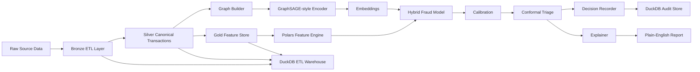
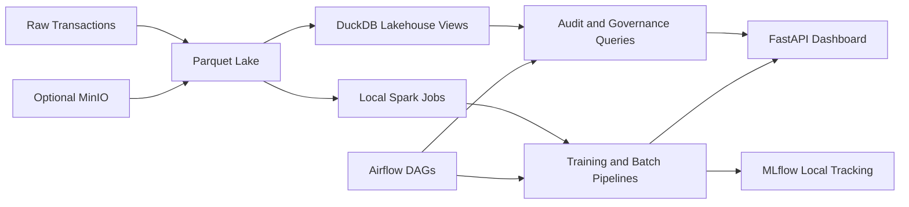
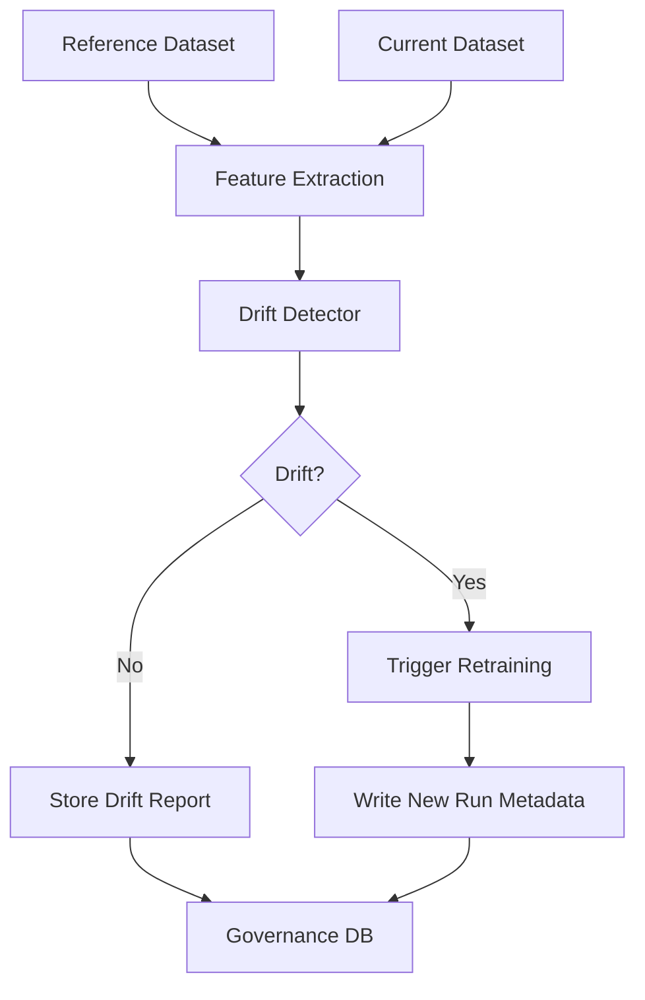
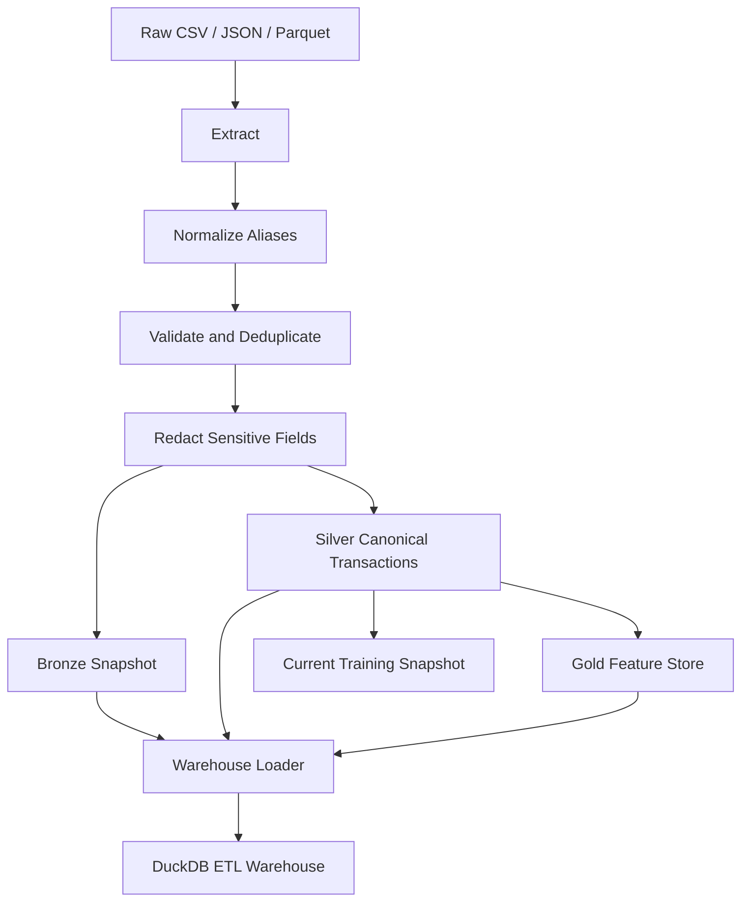
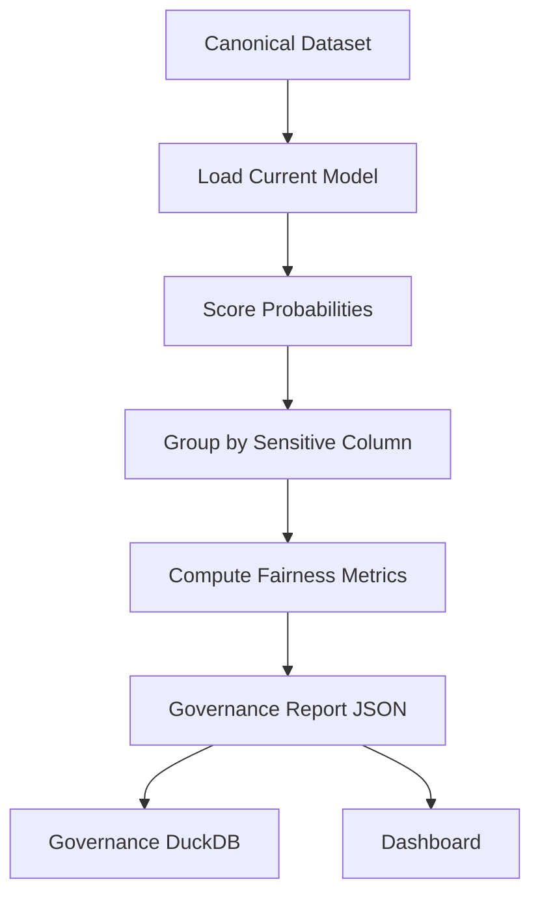

# Rift

**Graph ML for fraud detection, replay, and audit**

[](pyproject.toml)
[](LICENSE)

Rift is an auditable fraud detection system that combines graph-aware fraud scoring, calibrated probabilities, conformal uncertainty, deterministic replay, plain-English audit reports, and zero-cost local governance tooling.



## Why Rift exists

Fraud is relational, not just tabular. A realistic fraud system needs to account for shared devices, coordinated merchants, account reuse, temporal drift, and operational uncertainty. Rift packages those concerns into a single developer-friendly project that is practical enough to run and rigorous enough to demonstrate trustworthy ML ideas.

## What Rift proves

Rift is designed to demonstrate five claims:

1. relational structure can improve fraud detection;
2. time-aware evaluation matters;
3. scores should be calibrated before use in decisioning;
4. uncertainty belongs in high-stakes workflows;
5. explanations must be usable by non-technical reviewers.

## Quick start

Install the project in editable mode:

```bash
python3 -m pip install -e ".[dev]"
```

Install the optional local “managed-cloud-like” stack for MinIO, MLflow, and Spark-compatible local compute:

```bash
python3 -m pip install -e ".[dev,local-stack]"
```

Install the optional advanced governance stack for drift monitoring:

```bash
python3 -m pip install -e ".[dev,local-stack,advanced]"
```

Generate demo data, train a model, and score a sample transaction:

```bash
rift generate --txns 5000 --users 500 --merchants 120 --fraud-rate 0.03
rift train --model graphsage_xgb --time-split
rift predict --tx demo/sample_transaction.json
```

Replay a recorded decision or export an audit report:

```bash
rift replay <decision_id>
rift audit <decision_id> --format markdown
```

Run the ETL pipeline on a government-style raw source file:

```bash
rift etl run --source demo/government_transactions.csv --source-system treasury_disbursements --dataset-name gov_demo
rift etl status --limit 5
```

Prepare a public benchmark dataset, run a fairness audit, and train a local federated baseline:

```bash
rift dataset prepare --adapter ieee_cis --source demo/ieee_cis_sample.csv
rift fairness audit --sensitive-column channel
rift federated train --client-column channel --rounds 3 --local-epochs 2
```

Launch the built-in dashboard:

```bash
rift dashboard --host 127.0.0.1 --port 8000
```

Run the local orchestration and lakehouse workflow:

```bash
rift pipeline run --txns 1000 --users 100 --merchants 40 --fraud-rate 0.05
rift lakehouse build
rift lakehouse query --sql "select count(*) as transaction_count from transactions"
rift storage status
rift spark summary --data-path .rift/data/transactions.parquet
```

Generate governance artifacts and run monitoring:

```bash
rift governance generate-card
rift monitor drift --reference-path .rift/data/transactions.parquet --current-path .rift/data/transactions.parquet
rift query --natural "show recent flagged transactions"
rift sector list
```

## Current implemented surface

The current MVP ships these CLI commands:

- `rift dataset prepare --adapter <name> --source <path>`
- `rift dataset status`
- `rift etl run --source <path>`
- `rift etl status`
- `rift fairness audit --sensitive-column <column>`
- `rift fairness status`
- `rift governance generate-card`
- `rift monitor drift`
- `rift monitor drift-status`
- `rift federated train`
- `rift federated status`
- `rift sector list`
- `rift sector show --name <sector>`
- `rift storage status`
- `rift storage sync`
- `rift lakehouse build`
- `rift lakehouse query --sql <query>`
- `rift spark summary`
- `rift generate`
- `rift train`
- `rift predict --tx <path>`
- `rift replay <decision_id>`
- `rift audit <decision_id> --format {markdown,json}`
- `rift compare`
- `rift export --format {markdown,json}`
- `rift query --natural <query>`
- `rift reengineer simulate --source <path>`
- `rift pipeline run`
- `rift dashboard`

Supported training modes today:

- `xgb_tabular`
- `graphsage_only`
- `graphsage_xgb`

Supported public dataset adapters today:

- `ieee_cis`
- `credit_card_fraud`

Supported sector profiles today:

- `fintech`
- `healthcare`
- `energy`

Artifacts are written under `.rift/` by default:

- `.rift/data/transactions.parquet`
- `.rift/data/features.parquet`
- `.rift/datasets/*.parquet`
- `.rift/datasets/*.json`
- `.rift/etl/bronze/*.parquet`
- `.rift/etl/silver/*.parquet`
- `.rift/etl/gold/*.parquet`
- `.rift/etl/lineage/*.json`
- `.rift/etl/warehouse.duckdb`
- `.rift/governance/fairness/*.json`
- `.rift/governance/model_cards/*.md`
- `.rift/governance/drift/*.json`
- `.rift/governance/governance.duckdb`
- `.rift/federated/fed_*/artifact.pkl`
- `.rift/federated/fed_*/metrics.json`
- `.rift/queries/*.json`
- `.rift/reengineered/*.parquet`
- `.rift/storage/**/*`
- `.rift/lakehouse/rift_lakehouse.duckdb`
- `.rift/lakehouse/latest_pipeline_run.json`
- `.rift/mlruns/**/*`
- `.rift/runs/<run_id>/artifact.pkl`
- `.rift/runs/<run_id>/metrics.json`
- `.rift/audit/rift.duckdb`

## Open-source and zero-cost architecture

Rift is intentionally designed to stay open-source and zero-cost for core usage.

That means the default path uses:

- Python, FastAPI, Typer, and pytest;
- Parquet and DuckDB for storage and analytics;
- Polars and NumPy for data and feature processing;
- scikit-learn and XGBoost for modeling;
- local files and local processes rather than paid managed services.

Rift does **not** require BigQuery, DataProc, PubSub, proprietary dashboards, closed-source model hosting, or any paid cloud service to run its core workflows.

If optional integrations are added later, they should remain optional and must not replace the local OSS-first path.

## Local BigQuery/DataProc-style stack

Rift now includes a zero-cost local stack that mirrors the shape of a cloud-native analytics platform without introducing vendor lock-in.

The local equivalents are:

- BigQuery-style SQL analytics -> DuckDB over Parquet
- DataProc-style distributed processing -> local PySpark in `local[*]` mode
- GCS-style object storage -> local filesystem by default, optional MinIO-compatible S3 storage
- Airflow orchestration -> checked-in local DAGs plus Docker Compose services
- managed experiment tracking -> local MLflow file-backed tracking



This stack is designed to feel like a modern managed analytics platform while staying 100% open-source and zero-cost for local development, demos, and self-hosted deployment.

## Model cards and governance templates

Rift now includes OSS model card generation inspired by public model governance standards.

Each generated model card summarizes:

- model type and run metadata;
- training configuration and calibration settings;
- latest fairness audit;
- latest drift report;
- optimization metadata such as green-mode artifact reduction;
- governance caveats and ethical notes.

Model card templates are stored in:

- `docs/templates/model_card.md.j2`
- `docs/templates/governance_summary.md.j2`

Generated outputs are written under:

- `.rift/governance/model_cards/`

## Drift monitoring and retraining hooks

Rift now ships with a drift monitoring path that compares reference and current datasets using:

- `alibi-detect` when available;
- a built-in fallback z-score detector when optional drift dependencies are not installed.

The monitor can optionally trigger retraining when drift exceeds a chosen threshold.



## Sector profiles and plugins

Rift now includes config-driven sector profiles stored under `configs/sectors/`.

These profiles support:

- field alias normalization;
- privacy masking for sector-specific sensitive fields;
- sector defaults such as channel, category, and source system tags.

Current examples:

- healthcare claims
- energy billing
- fintech transactions

## Green optimization

Training and federated runs now support `--optimize green`.

The current green path is designed to remain lightweight and open-source:

- downcasts custom numeric model weights where safe;
- records estimated artifact size before and after optimization;
- logs the optimization metadata to run artifacts and model cards.

## Local natural-language audit queries

Rift now supports natural-language queries over audit and governance outputs.

By default it uses a deterministic heuristic translator to SQL so the feature works offline at zero cost.

If a local Ollama instance is available, Rift can also use it to summarize the query results for non-technical reviewers.

## Collaboration and CI

Rift now includes:

- local JupyterHub scaffolding in `docker/jupyterhub.yml`;
- a checked-in JupyterHub config under `hub-config/`;
- GitHub Actions validation gates under `.github/workflows/validate.yml`;
- CI helper scripts for fairness, drift, model cards, and query validation.

## Storage and lakehouse

Rift now exposes a storage abstraction and SQL-first lakehouse workflow.

Storage options:

- `local` backend by default
- `minio` backend optionally through S3-compatible object storage

Lakehouse capabilities:

- auto-built DuckDB views over current Parquet snapshots
- SQL queries over transactions, features, and ETL outputs
- end-to-end pipeline materialization for operational validation

Checked-in local stack files:

- `docker-compose.yml`
- `dags/rift_pipeline.py`
- `scripts/init_local_stack.sh`
- `scripts/validate_local_stack.sh`

## Government-ready ETL

Rift now includes an auditable ETL layer aimed at high-governance environments such as government finance, benefits, tax, and procurement workflows.

The pipeline supports:

- extraction from CSV, JSON, and Parquet sources;
- alias normalization from government-style source fields into Rift's canonical transaction schema;
- validation and bad-row filtering for timestamps and amounts;
- deterministic deduplication by transaction ID;
- redaction of direct sensitive fields such as names, emails, taxpayer identifiers, and addresses;
- bronze, silver, and gold data layers;
- lineage manifests and DuckDB warehouse loading for operational traceability.



## Fairness governance

Rift now includes a fairness audit pipeline for high-governance usage.

It supports:

- scoring a labeled dataset with the current model run;
- auditing outcomes by a sensitive column such as `channel`, `mcc`, or another group field;
- demographic parity difference;
- disparate impact ratio;
- equal opportunity difference when labels are available;
- persisted governance reports under `.rift/governance/`.



## Federated training scaffolding

Rift now ships with a zero-cost local federated learning scaffold for experimentation.

The current implementation:

- partitions training data by a client column such as `channel`;
- runs local logistic updates on each client;
- aggregates weights with a FedAvg-style weighted average;
- calibrates and evaluates the resulting global model;
- stores federated run artifacts separately under `.rift/federated/`.

This is intended as an OSS-first local simulator for collaboration and architecture design, not as a requirement for any proprietary orchestration platform.

## Dashboard

Rift includes a built-in operational dashboard served from the FastAPI app.

The dashboard surfaces:

- ETL lineage status;
- prepared public datasets;
- fairness audit summaries;
- drift monitoring summaries;
- federated run summaries;
- storage backend status;
- recent audit decisions;
- current model metrics.

## Architecture

Rift ships with:

- a synthetic fintech transaction simulator;
- public dataset preparation adapters;
- config-driven sector profiles;
- an auditable bronze/silver/gold ETL pipeline;
- a local storage abstraction with optional MinIO compatibility;
- a DuckDB lakehouse with SQL-first analytics;
- optional Spark-compatible local compute;
- local MLflow experiment logging;
- checked-in Airflow orchestration scaffolding;
- OSS model card and governance templates;
- drift monitoring with retrain hooks;
- local natural-language query support over governance and audit data;
- JupyterHub and CI validation scaffolding;
- a Polars feature pipeline;
- a heterogeneous-to-transaction graph builder;
- a GraphSAGE-style relational encoder;
- tabular and hybrid fraud models;
- calibration and conformal triage;
- fairness governance reports;
- local federated training scaffolding;
- a built-in dashboard for operations review;
- a DuckDB-backed replay and audit layer;
- CLI and FastAPI entry points.

## Demo flow

1. Generate a synthetic transaction history with injected fraud patterns.
2. Prepare public datasets or ingest external raw records through the ETL pipeline.
3. Build temporal and behavioral features.
4. Construct a relational graph between transactions and shared entities.
5. Train a tabular, hybrid, or federated baseline model.
6. Optionally apply green optimization metadata during training.
7. Calibrate the model and fit a conformal triage layer.
8. Run fairness audits over sensitive groups when required.
9. Run drift monitoring against new data and trigger retraining if needed.
10. Materialize lakehouse views and optionally sync artifacts to local or MinIO-compatible object storage.
11. Score new transactions and record each decision for replay.
12. Generate model cards and governance summaries for handoff and compliance review.
13. Review ETL lineage, governance outputs, storage status, and audit history in the dashboard.
14. Render plain-English audit reports for non-technical stakeholders.

## Experiments

The project supports the experiment themes laid out in the uploaded build spec:

- tabular vs graph-aware modeling;
- random vs chronological evaluation;
- raw vs calibrated scores;
- hard labels vs conformal triage.

Metrics include PR-AUC, recall at low FPR, Brier score, and expected calibration error.

## Audit mode

Every prediction can be recorded as an auditable decision receipt containing:

- the raw transaction payload;
- engineered features;
- the model run ID;
- calibrated probability and conformal band;
- the explanation and generated report;
- a deterministic decision hash.

See [AUDIT_GUIDE.md](AUDIT_GUIDE.md) for the non-technical walkthrough.

## API surface

The FastAPI app exposes:

- `POST /predict`
- `GET /replay/{decision_id}`
- `GET /audit/{decision_id}`
- `GET /datasets/status`
- `GET /etl/status`
- `GET /fairness/status`
- `GET /federated/status`
- `GET /monitor/drift-status`
- `GET /query`
- `POST /governance/model-card/{run_id}`
- `GET /storage/status`
- `GET /lakehouse/status`
- `GET /lakehouse/query`
- `GET /dashboard`
- `GET /dashboard/summary`
- `GET /metrics/latest`
- `GET /models/current`

Run it locally with:

```bash
uvicorn rift.api.server:app --reload
```

## Documentation conventions

To keep the repo aligned with shipped behavior:

- update Markdown/docs whenever CLI, API, audit output, or workflow behavior changes;
- use Mermaid blocks for all diagrams;
- do not add ASCII art diagrams to docs.

## Roadmap

Current MVP:

- public dataset adapters;
- auditable ETL ingestion and feature loading;
- local BigQuery/DataProc-style storage and lakehouse workflow;
- sector profiles and privacy masking;
- synthetic data generation;
- feature engineering;
- graph-aware hybrid training;
- model cards and governance templates;
- drift monitoring with optional retraining;
- natural-language governance and audit queries;
- fairness audit reporting;
- local federated training scaffolding;
- enterprise-style operations dashboard;
- calibration and conformal decision bands;
- deterministic replay and audit reporting.

Next iterations:

- stronger temporal graph models;
- richer counterfactuals;
- PDF report export;
- experiment notebooks and additional public dataset benchmarks;
- richer Ollama-backed summarization and retrieval when a local model is available;
- optional container smoke tests in CI when Docker is available.

```bash
pip install -e ".[dev]"
export PYTHONPATH=src

Contributions are welcome. Please see [CONTRIBUTING.md](CONTRIBUTING.md).

## License

[MIT](LICENSE)
