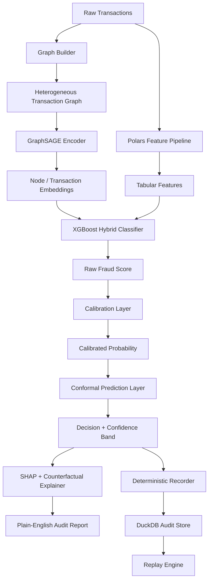

# Rift Architecture

## System Overview

Rift is a modular fraud detection system with six layers:

1. **Data Layer** - Synthetic transaction generation and temporal splitting
2. **Feature Layer** - Polars-based behavioral feature engineering
3. **Graph Layer** - Heterogeneous transaction graph construction
4. **Model Layer** - GNN encoders, gradient boosters, calibration, conformal prediction
5. **Audit Layer** - Decision recording, replay, explainability, report generation
6. **Product Layer** - CLI, FastAPI, Docker

## Data Flow

## Graph Schema

### Node Types

| Type | Description | Features |
|---|---|---|
| `user` | Account holder | Identity node |
| `merchant` | Transaction recipient | Identity node |
| `device` | Physical device used | Identity node |
| `account` | Financial account | Identity node |
| `transaction` | Single transaction | Engineered features |

### Edge Types

| Source | Relation | Target |
|---|---|---|
| user | initiates | transaction |
| transaction | at | merchant |
| transaction | via | device |
| transaction | from | account |
| user | uses | device |
| user | shops_at | merchant |
| account | linked | device |

## Model Pipeline

### Baseline A: Tabular XGBoost
- Input: Engineered features only
- Purpose: Sanity baseline proving graph adds value

### Baseline B: GraphSAGE Only
- Input: Transaction graph with node features
- Purpose: Shows what graph structure alone captures

### Flagship: GraphSAGE + XGBoost Hybrid
1. Train GraphSAGE encoder on heterogeneous graph
2. Extract 16-dimensional embeddings per transaction
3. Concatenate embeddings with engineered features
4. Train XGBoost on combined feature space

### Alternative: GAT + XGBoost
- Same pipeline as flagship but uses multi-head attention (GAT) encoder
- Attention weights indicate which neighbors mattered most

## Audit Database Schema (DuckDB)

| Table | Purpose |
|---|---|
| `transactions` | Raw transaction payloads |
| `features` | Computed feature vectors |
| `predictions` | Decision records with hashes |
| `model_registry` | Model metadata and metrics |
| `audit_reports` | Generated plain-English reports |
| `replay_events` | Replay verification logs |
