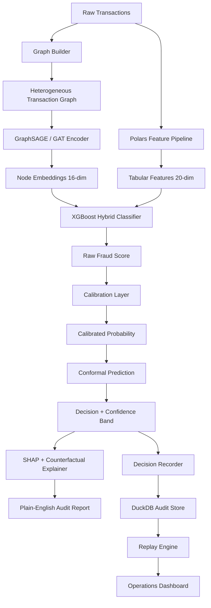

# Rift Architecture

## System Overview

Rift is a modular fraud detection platform with seven layers:

1. **Data Layer** -- Synthetic transaction generation, temporal splitting, ETL pipelines (bronze/silver/gold)
2. **Feature Layer** -- Polars-based behavioral feature engineering (20 features)
3. **Graph Layer** -- Heterogeneous transaction graph construction (5 node types, 7 edge types)
4. **Model Layer** -- GNN encoders (GraphSAGE, GAT), gradient boosters (XGBoost, LightGBM), calibration (isotonic/Platt), conformal prediction
5. **Audit Layer** -- Decision recording (SHA-256 + DuckDB), deterministic replay, SHAP explainability, plain-English reports, PII redaction
6. **Governance Layer** -- Fairness audits, drift monitoring, model cards, sector profiles, legacy reengineering, federated scaffolding
7. **Product Layer** -- FastAPI server, operations dashboard, Typer CLI, Next.js frontend, Docker, Colab notebooks

## Data Flow



## Graph Schema

### Node Types

| Type | Count (100K txns) | Features |
|---|---|---|
| `user` | ~5,000 | Identity (degree computed) |
| `merchant` | ~1,200 | Identity (fraud rate computed) |
| `device` | ~8,000 | Identity (sharing degree) |
| `account` | ~6,000 | Identity (device count) |
| `transaction` | 100,000 | 20-dim engineered features |

### Edge Types

| Source | Relation | Target |
|---|---|---|
| user | initiates | transaction |
| transaction | at | merchant |
| transaction | via | device |
| transaction | from | account |
| user | uses | device |
| user | shops_at | merchant |
| account | linked | device |

## Model Pipeline

### Baseline A: Tabular XGBoost
- Input: 20-dim engineered features only
- Purpose: Sanity baseline proving graph adds value

### Baseline B: GraphSAGE Only
- Input: Transaction graph with node features
- 2 layers, hidden dim 32, output dim 16, dropout 0.1
- Purpose: Shows what graph structure alone captures

### Flagship: GraphSAGE + XGBoost Hybrid
1. Train GraphSAGE encoder on heterogeneous graph
2. Extract 16-dimensional embeddings per transaction
3. Concatenate embeddings with 20-dim tabular features
4. Train XGBoost on combined 36-dim feature space

### Alternative: GAT + XGBoost
- Same pipeline with multi-head attention (4 heads, 2 layers)
- Attention weights indicate which neighbors mattered most

## Calibration and Conformal Prediction

**Calibration** maps raw scores to true probabilities via isotonic regression or Platt scaling. Target: ECE < 0.05.

**Conformal prediction** produces 3-class triage at alpha = 0.05:
- `high_confidence_fraud` -- block and investigate
- `review_needed` -- manual analyst review
- `high_confidence_legit` -- auto-approve

Target: 95% empirical coverage, average set size < 1.4.

## Audit Database Schema (DuckDB)

| Table | Purpose |
|---|---|
| `transactions` | Raw transaction payloads |
| `features` | Computed feature vectors |
| `predictions` | Decision records with SHA-256 hashes |
| `model_registry` | Model metadata and metrics |
| `audit_reports` | Generated plain-English reports |
| `replay_events` | Replay verification logs |

## Operations Dashboard

The dashboard provides at-a-glance visibility into:
- KPI cards with color-coded thresholds (PR-AUC, ECE, Brier)
- ETL pipeline run history
- Fairness audit results
- Drift monitoring reports
- Federated training runs
- Recent audit decisions
- Quick action links to key workflows

Served at `GET /dashboard` via FastAPI. See [docs/dashboard.md](dashboard.md) for details.

## Governance Layer

| Component | File | Purpose |
|---|---|---|
| Fairness audits | `src/rift/governance/fairness.py` | Demographic parity, disparity ratio checks |
| Model cards | `src/rift/governance/model_cards.py` | Jinja2-templated ethics/bias/impact cards |
| Drift monitoring | `src/rift/monitoring/drift.py` | Alibi-Detect + fallback z-score detector |
| NL queries | `src/rift/monitoring/nl_query.py` | Ollama + deterministic SQL fallback |
| Sector profiles | `src/rift/adapters/sectors.py` | YAML-driven field aliasing and PII masking |
| Legacy reengineering | `src/rift/reengineer/simulate.py` | SQL/CSV to Parquet to graph ML migration |
| Federated scaffolding | `src/rift/federated/simulation.py` | Zero-cost local federated training |
| Green optimization | `src/rift/optimize/green.py` | Downcasting + artifact size tracking |

## API Endpoints

| Method | Endpoint | Description |
|---|---|---|
| GET | `/health` | Health check |
| POST | `/predict` | Score a transaction |
| GET | `/replay/{decision_id}` | Replay a decision |
| GET | `/audit/{decision_id}` | Get audit report |
| GET | `/dashboard` | Operations dashboard (HTML) |
| GET | `/dashboard/summary` | Dashboard data (JSON) |
| GET | `/dashboard/governance` | Governance detail page |
| GET | `/exports/model-card/{run_id}` | Download model card |
| GET | `/exports/audit/{decision_id}` | Download audit report |
| GET | `/metrics/latest` | Latest model metrics |
| GET | `/models/current` | Current model info |
| GET | `/etl/status` | ETL run history |
| GET | `/fairness/status` | Fairness audit history |
| GET | `/monitor/drift-status` | Drift reports |
| GET | `/query?natural=...` | Natural language query |
| GET | `/lakehouse/query?sql=...` | SQL against lakehouse |
| GET | `/storage/status` | Storage backend info |

## Repository Structure

```
rift/
  src/
    data/           # Generator, schemas, splits (bare modules)
    features/       # Polars engine, aggregates, temporal
    graph/          # Builder, hetero_graph, windows, motifs
    models/         # XGBoost, GraphSAGE, GAT, ensemble, calibrate, conformal, train, infer
    replay/         # Recorder, replayer, lineage, hashing
    explain/        # SHAP, counterfactuals, report, nearest_neighbors, ollama_chat
    audit/          # Export, redact, templates
    api/            # FastAPI server, schemas
    cli/            # Typer CLI
    utils/          # Config, logging, seeds, io, colab_setup
    validate/       # Deepchecks suite
    monitoring/     # Evidently dashboard, MLflow setup
    search/         # FAISS vector search
    rift/           # Extended governance platform
      api/          # FastAPI server (extended)
      cli/          # Typer CLI (extended)
      dashboard/    # Operations dashboard (views, kpis, templates, static CSS)
      data/         # Generator, schemas, splits
      etl/          # Bronze/silver/gold ETL pipeline
      governance/   # Fairness, model cards
      monitoring/   # Drift, NL query
      federated/    # Federated training scaffold
      lakehouse/    # DuckDB lakehouse SQL
      adapters/     # Sector profiles
      storage/      # Local + S3-compatible backends
      reengineer/   # Legacy migration simulator
      optimize/     # Green optimization
      orchestration/ # End-to-end pipeline runner
  frontend/         # Next.js React dashboard (optional)
  notebooks/        # 6 Colab-compatible demo notebooks
  tests/            # 97 tests
  docs/             # Architecture, theory, experiments, dashboard, notebooks
  docker/           # Dockerfile, docker-compose
  configs/          # Sector YAML profiles
  dags/             # Airflow DAG scaffolding
  scripts/          # CI and setup scripts
```

## Technology Stack

| Layer | Technology | Purpose |
|---|---|---|
| Feature Engineering | Polars | Fast columnar feature computation |
| Graph Neural Networks | PyTorch (custom layers) | GraphSAGE, GAT encoders |
| Gradient Boosting | XGBoost / LightGBM | Tabular + embedding classification |
| Calibration | scikit-learn | Isotonic regression, Platt scaling |
| Conformal Prediction | Custom (distribution-free) | Uncertainty-aware triage |
| Explainability | SHAP | Feature importance attribution |
| Audit Store | DuckDB | Embedded analytical database |
| ETL | Polars + DuckDB | Bronze/silver/gold pipeline |
| Experiment Tracking | MLflow (SQLite backend) | Params, metrics, artifacts |
| Validation | Deepchecks | Data integrity, bias, performance |
| Monitoring | Evidently AI, Alibi-Detect | Drift detection |
| Vector Search | FAISS + sentence-transformers | Semantic audit search |
| LLM Chat | Ollama (local) | Natural language audit queries |
| Backend API | FastAPI | REST endpoints |
| Server Dashboard | Python + HTML + CSS | Server-rendered operations UI |
| Frontend Dashboard | Next.js + Tailwind + Recharts | Optional React UI |
| CLI | Typer + Rich | Command-line interface |
| Containerization | Docker + Compose | Reproducible deployment |
| CI/CD | GitHub Actions | Lint, test, validation gates |
