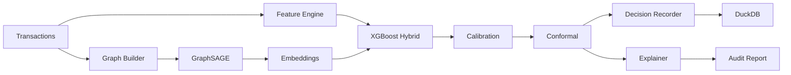

# Rift Architecture

## System Overview

## Components

- **Feature Engine**: Polars-based rolling aggregates, geo features, behavioral signals
- **Graph Builder**: Heterogeneous transaction graph (user, merchant, device, account, transaction nodes)
- **GraphSAGE/GAT**: Node embeddings for relational fraud signals
- **Hybrid Classifier**: GNN embeddings + tabular features → XGBoost
- **Calibration**: Isotonic/Platt for trustworthy probabilities
- **Conformal**: Uncertainty bands (high_conf_fraud, review_needed, high_conf_legit)
- **Recorder**: DuckDB audit store with deterministic hashing
- **Explainer**: SHAP + counterfactuals → plain-English reports
