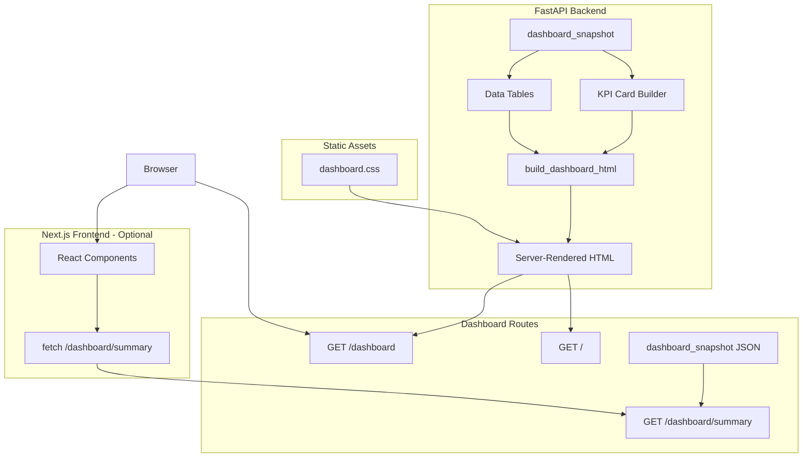
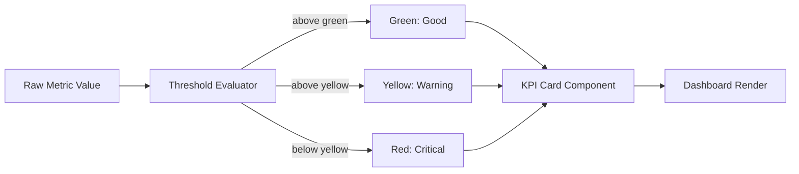

# Operations Dashboard

The Rift Operations Dashboard is the governance-focused UI layer that surfaces platform health, model performance, audit lineage, and compliance signals at a glance.

## Access

| Method | URL | Description |
|---|---|---|
| Server-rendered HTML | `GET /dashboard` | Full operations dashboard |
| Landing page | `GET /` | Hero landing with key metrics |
| JSON API | `GET /dashboard/summary` | Raw snapshot data as JSON |

Start the server:

```bash
rift dashboard --port 8000
# or
python -m rift.cli.main dashboard --host 127.0.0.1 --port 8000
```

Then visit `http://localhost:8000/dashboard`.

## Architecture



The dashboard is built with a hybrid rendering approach:

- **Server-rendered HTML** in `src/rift/dashboard/views.py` generates the full dashboard and landing page using Python f-strings with `html.escape()` for XSS safety.
- **Static CSS** in `src/rift/dashboard/static/dashboard.css` provides the enterprise dark theme with CSS custom properties.
- **Next.js frontend** in `frontend/` provides an optional React-based dashboard with Tailwind CSS, charts (Recharts), and animated components.

### Key Files

| File | Purpose |
|---|---|
| `src/rift/dashboard/views.py` | Dashboard snapshot collection, HTML rendering, landing page |
| `src/rift/dashboard/kpis.py` | Centralized KPI threshold logic with color-coded status bands |
| `src/rift/dashboard/__init__.py` | Package exports |
| `src/rift/dashboard/static/dashboard.css` | Dark theme CSS with responsive breakpoints |
| `src/rift/api/server.py` | FastAPI routes for dashboard, exports, predictions |
| `frontend/` | Optional Next.js/React dashboard |

## KPI Cards



KPI cards display governance and model health metrics with color-coded status:

| Metric | Green | Yellow | Red | Direction |
|---|---|---|---|---|
| PR-AUC | >= 0.85 | >= 0.70 | < 0.70 | Higher is better |
| ECE | <= 0.05 | <= 0.10 | > 0.10 | Lower is better |
| Brier Score | <= 0.12 | <= 0.20 | > 0.20 | Lower is better |
| Recall@1%FPR | >= 0.60 | >= 0.40 | < 0.40 | Higher is better |

Count-based KPIs (ETL runs, fairness audits, drift reports, federated runs, recorded audits) use the accent color.

Thresholds are centrally defined in `src/rift/dashboard/kpis.py` and can be modified without touching templates.

## Data Tables

The dashboard shows six data tables:

1. **Latest ETL Runs** -- source system, valid/invalid rows, duplicates removed
2. **Recent Fairness Audits** -- sensitive column, demographic parity, disparity ratio
3. **Recent Drift Reports** -- drift score, is_drift flag, retrain trigger
4. **Federated Training Runs** -- client column, client count, rounds
5. **Prepared Public Datasets** -- adapter, rows prepared, ETL run ID
6. **Recent Audit Decisions** -- decision ID, model run, outcome, calibrated probability, confidence

Each table shows guided empty states with CLI commands when no records exist.

## API Routes

### Dashboard and Landing Routes

| Method | Endpoint | Returns |
|---|---|---|
| GET | `/` | Landing page (HTML) |
| GET | `/dashboard` | Full operations dashboard (HTML) |
| GET | `/dashboard/summary` | JSON snapshot |

### Export Routes

| Method | Endpoint | Returns |
|---|---|---|
| GET | `/dashboard/export/model-card` | Download latest model card as markdown |
| GET | `/dashboard/export/audit` | Download latest audit report as markdown |

### Prediction and Audit Routes

| Method | Endpoint | Returns |
|---|---|---|
| POST | `/predict` | Score a transaction and record decision |
| GET | `/replay/{decision_id}` | Replay a past decision |
| GET | `/audit/{decision_id}` | Get audit report for a decision |
| GET | `/metrics/latest` | Latest model metrics |
| GET | `/models/current` | Current model info |

### Governance and Monitoring Routes

| Method | Endpoint | Returns |
|---|---|---|
| POST | `/governance/model-card/{run_id}` | Generate model card for a run |
| GET | `/fairness/status` | Recent fairness audits |
| GET | `/monitor/drift-status` | Recent drift reports |
| GET | `/query?natural=...` | Natural language query |
| GET | `/etl/status` | Recent ETL runs |
| GET | `/datasets/status` | Prepared datasets |
| GET | `/federated/status` | Federated training runs |
| GET | `/storage/status` | Storage backend info |
| GET | `/lakehouse/status` | Lakehouse DB path |
| GET | `/lakehouse/query?sql=...` | Run SQL against lakehouse |
| GET | `/health` | Health check |

## Next.js Frontend (Optional)

The `frontend/` directory contains an optional React-based dashboard built with:

- **Next.js 14** with App Router
- **Tailwind CSS** for styling
- **Recharts** for performance trend and operations breakdown charts
- **Animated number components** for KPI transitions

To run:

```bash
cd frontend
npm install
npm run dev
```

The frontend connects to the same FastAPI backend at `http://localhost:8000`.

## Customization

### Changing Thresholds

Edit `src/rift/dashboard/kpis.py`:

```python
THRESHOLDS = {
    "pr_auc": {"green": 0.85, "yellow": 0.70, "lower_is_better": False},
    "ece": {"green": 0.05, "yellow": 0.10, "lower_is_better": True},
}
```

### Adding Quick Actions

Edit `QUICK_ACTIONS` in `src/rift/dashboard/kpis.py`:

```python
QUICK_ACTIONS = [
    ActionLink("Run Prediction", "/predict"),
    ActionLink("Latest Model Card", "/governance/model-card/latest"),
    ...
]
```
