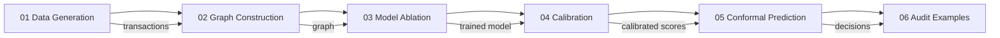

# Interactive Notebooks

Rift ships with 6 Colab-compatible Jupyter notebooks that walk through the complete fraud detection pipeline, from data generation through audit report generation. Each notebook is self-contained and can be run directly in Google Colab with zero local setup.

## Quick Start (Colab)

Click any badge to open the notebook in Google Colab:

| Notebook | Topic | Colab |
|---|---|---|
| `01_data_generation` | Synthetic transactions with 7 fraud patterns | [](https://colab.research.google.com/github/AngelP17/Rift/blob/main/notebooks/01_data_generation.ipynb) |
| `02_graph_construction` | Heterogeneous graph (5 node types, 7 edge types) | [](https://colab.research.google.com/github/AngelP17/Rift/blob/main/notebooks/02_graph_construction.ipynb) |
| `03_model_ablation` | XGBoost vs GraphSAGE vs Hybrid vs GAT | [](https://colab.research.google.com/github/AngelP17/Rift/blob/main/notebooks/03_model_ablation.ipynb) |
| `04_calibration` | Platt vs Isotonic on ECE and Brier | [](https://colab.research.google.com/github/AngelP17/Rift/blob/main/notebooks/04_calibration.ipynb) |
| `05_conformal` | Uncertainty-aware 3-class fraud triage | [](https://colab.research.google.com/github/AngelP17/Rift/blob/main/notebooks/05_conformal.ipynb) |
| `06_audit_examples` | Reports, replay, lineage, PII redaction | [](https://colab.research.google.com/github/AngelP17/Rift/blob/main/notebooks/06_audit_examples.ipynb) |

## Notebook Pipeline



Each notebook builds on the output of the previous one, but each is also self-contained -- it generates its own data if needed.

## Notebook Details

### 01 - Data Generation

Demonstrates the synthetic transaction generator with configurable parameters (transaction count, user count, merchant count, fraud rate, seed). Explores:
- Transaction distributions (amount, channel, currency, MCC)
- Fraud pattern analysis across the 7 injected patterns
- Temporal distribution of fraud over time
- Reproducibility verification (same seed produces identical output)

### 02 - Graph Construction

Builds and explores the heterogeneous transaction graph:
- 5 node types (user, merchant, device, account, transaction) connected by 7 edge types
- Homogeneous projection for GNN training
- Graph motif features (in-degree, out-degree, triangle counts)
- Rolling-window graph construction for temporal evaluation
- Fraud vs legitimate connectivity analysis

### 03 - Model Ablation

Side-by-side comparison of all four model variants on temporal splits:
- Baseline A: Tabular XGBoost (features only)
- Baseline B: GraphSAGE only (graph only)
- Flagship: GraphSAGE + XGBoost hybrid
- Alternative: GAT + XGBoost

Also runs the temporal leakage experiment comparing random vs temporal splits.

### 04 - Calibration

Demonstrates why calibration matters for operational fraud decisioning:
- Raw vs Platt vs Isotonic calibration comparison
- ECE and Brier score improvement
- Reliability curves showing alignment with true probabilities
- Proof that calibration preserves ranking (PR-AUC unchanged)

### 05 - Conformal Prediction

Shows uncertainty-aware triage with conformal prediction:
- 3-class output: high_confidence_fraud, review_needed, high_confidence_legit
- Coverage and set-size metrics (target: 95% coverage, < 1.4 set size)
- Band distribution analysis
- Hard-label vs conformal comparison
- Per-sample prediction detail view

### 06 - Audit Examples

Full audit lifecycle demonstration:
1. Train a model
2. Score transactions and record decisions (SHA-256 hashed)
3. Generate plain-English audit reports
4. Deterministic replay verification
5. Decision lineage tracing
6. PII redaction for external distribution

## Colab Setup Helper

The `src/utils/colab_setup.py` module provides automatic environment configuration:

```python
from utils.colab_setup import setup_rift
env = setup_rift(branch="main", mount_gdrive=False)
```

This:
1. Clones the Rift repo into `/content/Rift`
2. Installs all dependencies (auto-detects GPU for torch)
3. Configures `PYTHONPATH` for bare module imports
4. Optionally mounts Google Drive for artifact persistence

### Helper Functions

| Function | Description |
|---|---|
| `is_colab()` | Detect Google Colab environment |
| `is_gpu_available()` | Check CUDA availability |
| `get_device()` | Return "cuda" or "cpu" |
| `clone_repo(branch, force)` | Clone/pull repo |
| `install_deps()` | Install with CPU/GPU torch |
| `configure_pythonpath()` | Set up module path |
| `mount_drive()` | Mount Google Drive |
| `setup_rift()` | One-call orchestrator |

## Running Locally

```bash
cd notebooks
jupyter notebook
# or
jupyter lab
```

Ensure `PYTHONPATH=src` is set or run from the repo root.
